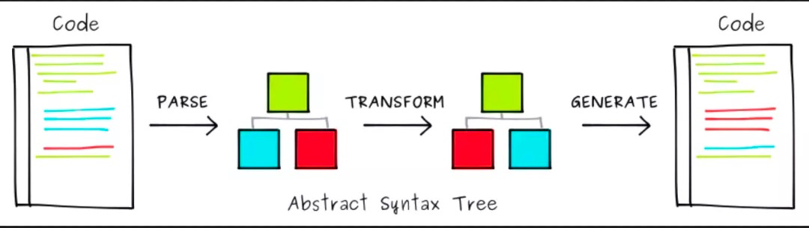

# babel进阶

前主流的项目中的 devDependencies，会发现各种各样的模块工具；例如JavaScript转译、css预处理器、elint、pretiier都会用到babel解析的AST。

**Babel 的解析器 Babel**

[AST 辅助开发工具](https://astexplorer.net/)

## babel对代码的转化过程



- parse: 把代码解析为AST 
> @babel/parser

```
const ast = parser(rawSource, {
  sourceType: 'module',
  plugins: [
    "jsx",
  ],
});
```
- transform: 对代码进行操作
> @babel/traverse
```
const ast = parse(`function square(num) {
  return num * num;
}`);

traverse(ast, { // 进行 ast 转换
    Identifier(path) { // 遍历变量的visitor
      // ...
    },
    // 其他的visitor遍历器
  } 
)
```
- generator: AST还原成代码
> @babel/generator
```
const output = generate(ast, { /* options */ });
```

- 对AST节点操作，判断的类似于函数库
> @babel/types
```
// is开头的用于判断节点
types.isObjectProperty(node);
types.isObjectMethod(node);

// 创建 null 节点
const nullNode = types.nullLiteral();
// 创建 square 变量节点
const squareNode = types.identifier('square');
```
- @bable/types 可以创建 ast 节点，但过于繁琐，通过 @babel/template 则可以快速创建整段的 ast 节点

> @babel/template

```
// 使用 @babel/template
// 创建节点输入源代码即可，清晰易懂
const template = require('@babel/template').default;
const ast = template.ast(`import React from 'react'`);
// path.replaceWith(ast) // 节点替换
```

## 实战 

### 代码实战

- Babel插件规则
> Babel的插件模块，需要暴露一个function，function内返回visitor对象

1. 将函数参数sum换成n

```
转换前
function square(num) {
  return num * num;
}
转换后
function square(n) {
  return n * n;
}
```

代码：
```
module.exports = () => {
  return {
    visitor: {
      Identifier(path) {
        // 三个前置判断
        if (path.node.name !== 'num') { // 变量需要为 num
          return;
        }
        if (path.parent.type !== 'FunctionDeclaration') { // 父级需要为函数
          return;
        }
        if (path.parent.id.name !== 'square') { // 函数名需要为 square
          return;
        }
        const referencePaths = path.scope.bindings['num'].referencePaths; // 找到对应的引用
        referencePaths.forEach(path => path.node.name = 'n'); // 修改引用值
        path.node.name = 'n'; // 修改自身的值
      },
    }
  }
};
```
2. 将文件中的let, cons转化为let, 箭头函数转化为普通函数

plugins/changeKeyWord.js
```
module.exports = function({type: t}) { // babel-types
    return {
        visitor: {
            VariableDeclaration(path) { // 变量对应的访问者属性
                const node = path.node;
                ['let', 'const'].includes(node.kind) && (node.kind = 'var');
            },
            ArrowFunctionExpression(path) {
                let { id, params, body, generator, async } = path.node;
                //箭头函数我们会简写{return a+b} 为 a+b
                if (!t.isBlockStatement(body)) {    
                    const node = t.returnStatement(body);
                    body = t.blockStatement([node]);
                }
                path.replaceWith(t.functionExpression(id, params, body, generator, async));
            }

        }
    };
}
```

index.js
```
// transform将源码转化为ast, 进行操作之后，任然返回源码
const {transform} = require('@babel/core'); 

const fs = require('fs');
const content = fs.readFileSync('./before.js', 'utf8');

const res = transform(`${content}`, {
    plugins: [require('./plugins/changeKeyWord')],
});

fs.existsSync('./after.js') && fs.unlinkSync('./after.js');
fs.writeFileSync('./after.js', res.code, 'utf8')
```

> Visitors (访问者): 简单的说它们就是一个对象，定义了用于在一个树状结构中获取具体节点的方法。

### 定义一个babel-plugin集成在webpack

```
const { declare } = require('@babel/helper-plugin-utils');
module.exports = declare((api, options) => {
  return {
    name: 'your-plugin', // 定义插件名
    visitor: { // 编写业务 visitor
      Identifier(path,) {
        // ...
      },
    }
  }
});
```

```
// 配置 babel.config.js
module.exports = {
    presets: [
        require('@babel/preset-env'), // 可配合通用的 present
    ],
    plugins: [
        require('your-plugin'),
        // require('./your-plugin') 也可以为相对目录
    ]
};
```

### 自定义一个eslint规则插件

```
// eslint-plugin-my-eslint-plugin
module.exports.rules = { 
  "var-length": context => ({ 
    // 定义 var-length 规则，对变量长度进行检测
    VariableDeclarator: (node) => { 
      if (node.id.name.length <= 1){ 
        context.report(node, '变量名长度需要大于1');
      }
    }
  })
};
```

```
// .eslintrc.js
module.exports = {
  root: true,
  parserOptions: { ecmaVersion: 6 },
  plugins: [
   "my-eslint-plugin"
  ],
  rules: {
    "my-eslint-plugin/var-length": "warn" 
  }
};
```

## 参考文章：

- [Babel是什么？我们为什么要了解它?](https://blog.csdn.net/qiwoo_weekly/article/details/114909047)

- [用JS解释JS！详解AST及其应用](https://mp.weixin.qq.com/s/j8_8QwFnyOr66m9aekor1g)

- [你所需要知道的最新的babel兼容性实现方案](https://mp.weixin.qq.com/s/DlFg0_BMP_VfL9Yn2k-m-w?forceh5=1)