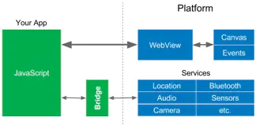
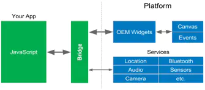
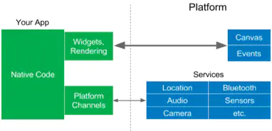
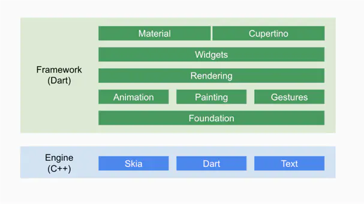

# 移动端web解决方案

## webview hybrid的开发模式

基于WebView的Cordova、AppCan等，ionic

- 优势

  - 成本低： 
 几乎可以完全继承现代Web开发的所有成果（丰富得多的控件库、满足各种需求的页面框架、完全的动态化、自动化测试工具等等），当然也包括Web开发人员，不需要太多的学习和迁移成本就可以开发一个App；
  - 功能发版容易（原生发版需要审核，很麻烦）

- 劣势

  - 性能太差：webview渲染效率，js执行能力差，所以做出来的效果很难接近原生的效果

  - 版本兼容问题：android各个系统版本差异以及设备厂商的定制问题，很难保证在所有设备上提供一致的体验。

通过jsBridge与原生进行通信

## reactNative（react）, weex（vue）

编写HTLM+css+js的ui逻辑，但最终都是被转化为自定义的原生空间。

- 优势
  - 前端开发切入成本小，相对于webview来说性能得到提升

- 劣势
  - 框架需要处理大量平台先关逻辑，随着系统版本变化，开发者也需要处理不同的平台差异，甚至某系特性只能在特定平台才能使用。
  
通过jsBridge与原生进行通信

## flutter 

从头到尾重写一套跨平台的UI框架，包括ui控件，渲染逻辑，开发语言；渲染引擎就是SKIA图形库来实现，依赖系统只有图形绘制先关的接口。
与rn，weex不同的是在flutter中所有的工能都是通过多个widget组合来实现的，包括元素，布局排版，事件处理

- 优势
  - 保证了不同平台，设备的体验一致

- 劣势

  - dart语法的嵌套编写方式使代码看起来难以阅读，以及增加了维护的难度

### flutter的原理分析

flutter可分为 Framework层和Flutter Engine

- Framework层全部使用Dart编写，有完整UI框架的API，并预写了Android（MaterialDesign）和IOS的（Cupertino）风格的UI,极大方便了开发移动端.

- Framework 底层是 Flutter 引擎， 引擎主要负责图形绘制 (Skia)、 文字排版 (libtxt) 和提供 Dart 运行时， 引擎全部使用 C++实现.

flutter界面是通过 skia绘制，原生的通信是通过paltform channels

[Flutter 高性能原理浅析](https://juejin.im/post/6844903901641048077#heading-12)

[Flutter原理与实践](https://tech.meituan.com/2018/08/09/waimai-flutter-practice.html)

[全网最全 Flutter 与 React Native 深入对比分析](https://zhuanlan.zhihu.com/p/70070316)