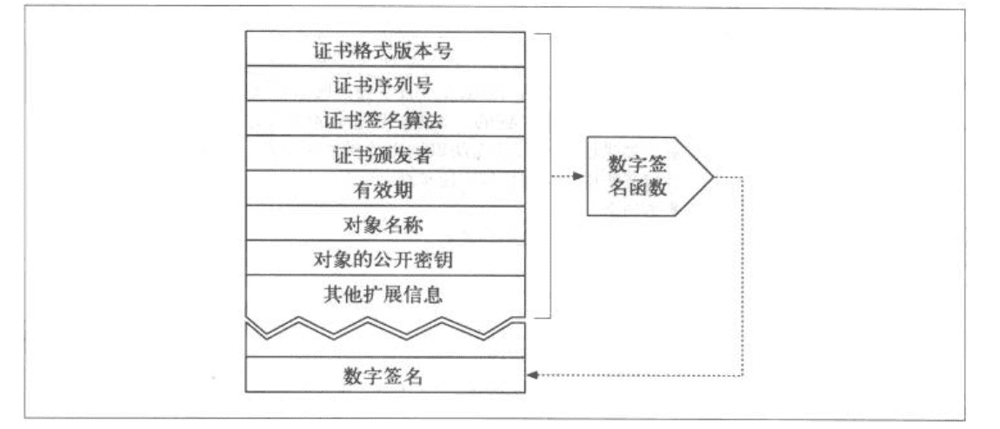
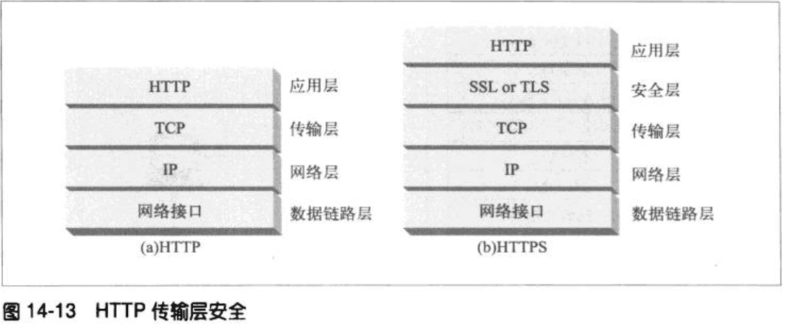

# 关于Https的知识点

## 数据加密

HTTPS请求和响应数据在发送到网络之前，都会进行加密处理（ssl,TLS）

ssl：secure socket layer

tls：transport layer security

相比http而言https会在传输层上多了一层安全层（ssl/tls），大部分的编码解码工作都在SSL上完成的。

使用密码对明文进行加密之后就成为秘文。

### 对称加密技术

编码时候使用的密匙值和解码时是一样的。发送端使用共享的密匙和加密算法对报文进行加密，发送给接受端；接受端使用对应的密匙和解码算法进行解码。

**缺点：**  发送者和接受者在相互对话之前，需要一个共享的保密密匙；比如A，B，C都想与J进行通信，那么就需要建立密钥K(aj)，k(bj)，k(cj)；如果有N个节点，每个节点都需要和其他所有N-1个节点进行安全对话，总共大概会有N*N个保密密钥，很难管理，于是出现了公开密钥的加密技术。

### 非对称加密技术

使用两个非对称秘匙，一个用来对主机报文进行编码（公钥），一个对其进行解码（私钥）

服务器将其公钥公布于众，保留私钥，任何想和服务器进行通信的节点都可利用这个公钥进行报文加密，然后服务器利用私钥进行解密，有效的避免了对称加密密钥的管理问题。

**缺点** 公开密钥加密算法计算速率比对称加密算法慢

### 混合加密系统和会话密钥

常见做法是在两个节点之间通过公开密钥建立安全通信，然后再用这条安全的通道产生并发送随机的对称密钥，通过更快的对称加密技术对其余的数据进行加密。

## 数字签名

**作用：**

- 证明是不是目标服务器编写的报文

- 签名可以验证报文是否被修改

数据报文在传输途中可能会被截取，修改，因此客户端需要验证收到的报文是不是目标节点发送过来的，其中数字签名就是营运而生。

**原理**

>数字签名是用非对称加密技术产生的，因为只有作者（目标服务器）知道私有密钥，所以可以将作者的私有密钥当作一种指纹。

服务器会使用私钥作为参数对报文摘要进行加密处理生成签名，然后将连同报文一起发送给客户端；客户端使用公钥对其签名进行解析，然后使用相同的加密算法对报文做处理得到一个新的数字摘要，如果解析后的摘要和自己的摘要相同则认为是数据未被修改。

## 数字证书

通常是由官方的“证书颁发机构”以数字方式签发，但是任何人都可以创建数字证书。

通过Https建立链接之后，浏览器会自动获取服务器的数字证书，如果没有则会链接失败;
如果这个机构是很权威的公共签名机构，浏览器可能早已安装了对应的证书。

服务器证书包含很多信息如下：

如果对签名机构一无所知，浏览器不知道是否信任这个签名颁发机构，会出现弹窗提醒。

[详解https数据加密过程以及服务器身份认证](https://mp.weixin.qq.com/s/G14lN4SCkWN5Bs_SWeX-6g)

https就是在安全的传输层上发送HTTP，在将HTTP报文发送给TCP(传输控制协议)之前需要
在安全层通过SSL/TSL对其进行加密。

## 建立安全传输

未加密的HTTP,客户端会通过三次握手打开一条web服务器端口80的tcp链接，就可以发送请求，接受响应报文了。

如果是https，则是会三次握手建立一个端口号为443的TCP链接，然后就会初始化ssL(简称ssl握手)，对加密参数进行沟通，初始化完成之后客户端接可以将报文发送给安全层，安全层加密传递给传输层。

### ssl握手

在发送加密的HTTP报文之前，客户端需要和服务器进行一次SSL握手，这个握手主要是完成一下工作：

- 交换协议版本号
- 选择两端都了解的密码
- 两端身份的认证
- 生成零时会话密钥，加密信道

具体步骤：

- 第一步，客户端给出加密协议版本号、一个客户端生成的**随机数**（Client random），以及客户端支持的加密方法。

- 第二步，服务器确认双方使用的加密方法，并给出数字证书、以及一个服务器生成的**随机数**（Server random）。

- 第三步，客户端确认数字证书有效，然后生成一个新的**随机数**（Premaster secret），并使用数字证书中的公钥，加密这个随机数，发给服务器。

- 第四步，服务器使用自己的私钥，获取客户端发来的随机数（即Premaster secret）。

- 第五步，客户端和服务器**根据约定的加密方法，使用前面的三个随机数，生成"对话密钥"**（session key），用来加密接下来的整个对话过程。

生成对话密钥一共需要三个随机数；握手之后的对话使用"对话密钥"加密（对称加密），服务器的公钥和私钥只用于加密和解密"对话密钥"（非对称加密），无其他作用；服务器公钥放在服务器的数字证书之中。

[SSL协议的握手过程](http://www.ruanyifeng.com/blog/2014/09/illustration-ssl.html)

### ssl延时

HTTPs链接和HTTP链接都建立在TCP协议之上。HTTP链接比较单纯，使用三个握手数据包建立连接之后，就可以发送内容数据了。

再来看HTTPs链接，它也采用TCP协议发送数据，所以它也需要上面的这三步握手过程。而且，在这三步结束以后，它还有一个SSL握手。

>HTTP耗时 = TCP握手

>HTTPs耗时 = TCP握手 + SSL握手

所以，HTTPs肯定比HTTP耗时，这就叫SSL延迟。

[SSL延迟有多大？](http://www.ruanyifeng.com/blog/2014/09/ssl-latency.html)