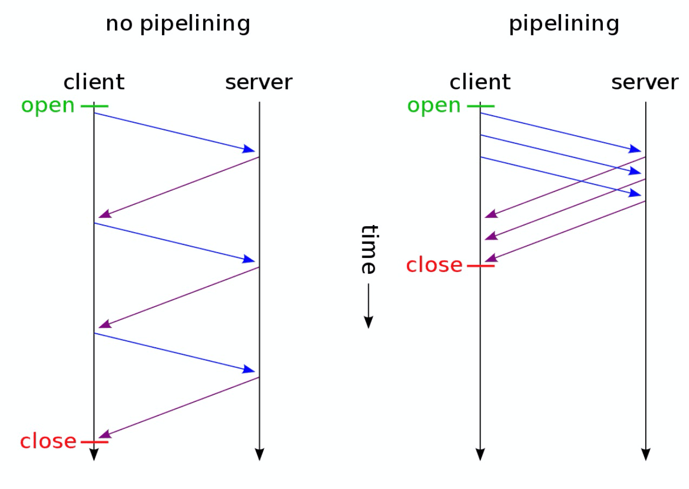

# 对比keep-alive， 管线化，http2多路复用

## 相同点

**背景**

每个http请求都要求打开一个tcp链接（三次握手），每一次使用之后就会断开这个tcp链接，这是十分消耗资源的以及对于高响应的请求来说是不可接受的。

**目的**

为了减少tcp链接带来的时间延时，以及资源消耗，目的都是为了提高请求响应速度

## 不同点

### keep-alive原理

HTTP1.0的Keep-Alive和HTTP1.1的persistent

>只是延时关闭这个tcp链接，让同一个链接上能传送多个http请求（**但请求都是串行的**）

使用keep-alive的timeout时间设置参数，比如nginx的keepalive_timeout，和Apache的KeepAliveTimeout。这个keepalive_timout时间值意味着：**一个http产生的tcp连接在传送完最后一个响应后，还需要hold住keepalive_timeout秒后，才开始关闭这个连接**。

现代浏览器大多采用**并行连接**与**持久连接**共用的方式提高访问速度，对每个域名建立并行地少量持久连接。

另外由于“TCP慢启动”的原因，持续链接会增加数据的传输速率

>TCP慢启动：为了防止数据传输的突然过载和拥塞，Tcp数据传输的性能取决于TCP链接的使用时间，TCP链接的使用时间越长，那么这个TCP链上数据传输的速率就越快。

[HTTP Keep-Alive是什么？](http://www.nowamagic.net/academy/detail/23350305)

### 管线化原理

基于持久链接的基础上，HTTP1.1进一步支持使用管道化特性；持久链接只是延时关闭tcp链接，允许多个请求串行的使用同一个链接，em: A请求发送请求建立了tcp链接，服务器响应成功，
B发起请求复用A创建的TCP链接，C请求也是如此。

管线化允许在同一个tcp链接发送多个http请求（A发送成功了就发送B），不需要等前一个请求被响应（A请求发送完成，B请求就可以发送了）, 这个以有效的减少请求等待的时间提高响应速度；
但是响应是按顺序的，只有A响应成功了，B才能被响应。

**管道化的限制**

- 管道化要求服务器按照发送的顺序返回响应(FIFO)（因为http请求和响应并没有序列号标识）,无法将乱序的响应与请求关联起来。

- 客户端需要保持未收到响应的请求，当连接意外中断时，需要重新发送这部分请求。

- 只有**幂等的请求**才能进行管道化，也就是只有GET和HEAD请求才能管道化，否则可能会出现意料之外的结果

**幂等性**

>从定义上看，HTTP方法的幂等性是指一次和多次请求某一个资源应该具有同样的副作用。

**管道化引起的对头阻塞**

前面提到HTTP管道化要求服务端必须按照请求发送的顺序返回响应，那**如果一个响应返回延迟了，那么其后续的响应都会被延迟，直到队头的响应送达**。

### http2二进制分帧数，多路复用

**背景：**

管道化会有对头阻塞的风险，原因就是响应顺序必须按照请求顺序，如果对头响应延时会造成所有的请求被阻塞。之所以要按照顺序响应原因就是为了
能够将响应与请求一一对应起来。

如果我们有一种方案能够对信息进行标识那么就会避免这种情况的了，这就是http2二进制分帧。

**原理**

HTTP2不使用管道化的方式，而是引入了**帧、消息和数据流**等概念，**每个请求化为流，每个请求/响应内容被称为消息，每个消息都被拆分成若干个帧进行传输，每个帧都分配一个序号（stream identifier标明这个帧输入那个流）**；在对方接收时，根据stream identifier拼接每个“流”的所有帧组成一整块数据，这样就避免了请求/响应阻塞。

当然，即使使用HTTP2，如果HTTP2底层使用的是TCP协议，仍可能出现[TCP队头阻塞](https://http3-explained.haxx.se/zh/why-quic/why-tcphol)

其实可以这样理解虽然http2允许同时并行发送多个请求，但是tcp链接只有一条，多个请求数据流的消息在通过tcp之前就会按照数据流的序列号进行分帧处理，在tcp传输的时候仍然是串行传输，因此如果其中一个点丢失了，链路上之后的内容就都需要等待。

**note**

在一个tcp链接上http2可以无限制的并行请求下载，不过，HTTP/2还是提供了 SETTINGS_MAX_CONCURRENT_STREAMS 字段在 SETTINGS帧上设置，可以限制并发流数目。

