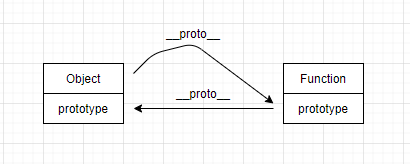
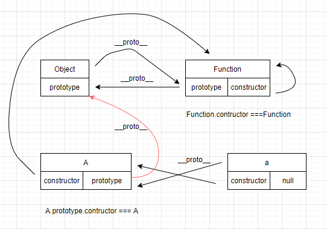

# 理解instanceof，typeof，Object.prototype.toString

## instanceof的原理

A instanceof B

判断B的prototype是否在A的原型链上

- Object instanceof Object 结果及原因？

> true

```
Object.__proto__ === Function.prototype;

Function.prototype.__proto__ === Object.prototype
```

- Function instanceof Function 结果及原因？

> true

```
Function.__proto === Function.prototype
```


**instance存在的纰漏**

- 左侧的变量一定要是一个对象实例

```
1 instanceof Number // error

new Number(1) instanceof === Number 
```

- 不能做精确区分

从他的实现原理来看，只要左侧的实例对象原型链上能找到右侧对象的原型都是满足条件的，所以不能做精确区分

```
[] instanceof Object            // true
null instanceof null            // error
undefined instanceof undefined  // eorror
```

## typeof用于判断当前变量的类型

js基本类型：null, undefined, bool, number, string, object, symbol

```
let a = 5;
let b = {};
let fun = () => {};

typeof a === 'number';
typeof b === 'object';
typeof fun === 'function';
```

**但是有些情况不能准确判断**

- 不能区分null和object
```
let a = null;
typeof a = 'object'
```
- 不能区分array和object
```
typeof [] === 'object'
```
js中数组也是对象，所以在某些实际场景中typeof不是很好用

## Object.prototype.toString

```
Object.prototype.toString.call(1) === '[object Number]'

Object.prototype.toString.call(false) === '[object Boolean]'

Object.prototype.toString.call('') === '[object String]'

var sym3 = Symbol('foo');
Object.prototype.toString.call(sym3) === '[object Symbol]'

Object.prototype.toString.call(new Date()) ==='[object Date]'

Object.prototype.toString.call(new RegExp()) ==='[object RegExp]'

Object.prototype.toString.call(Map()) === '[object Map]'
```

## 一起看看function/class的实例对象的原型继承

```
function A() {
  this.name = 'tom';
  this.getName() { return this.name}'
}

// or 

class A {
  constructor(name) {
    this.name = name
  }
  getName() {
    return this.name;
  }
}
let a = new A();
```
- A.prototype. __ proto __ === Object.prototype
- A. __ proto __ === Funtion.prototype
- A.constructor === Function
- A.prototype.constructor === A

- a. __ proto __ === A.prototype
- a.constructor === A



**note：a不是构造函数所以没有prototype**


https://juejin.im/post/5b0b9b9051882515773ae714