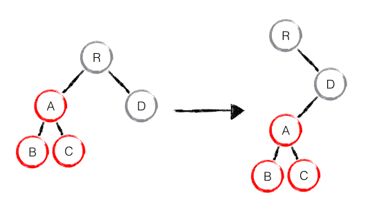

# react使用优化实践

### setState 只管理渲染相关的数据

临时变量，数据，以及其他只是用来做标记或者与后端交互这些值不应该用setState

## this的绑定问题

### 1）渲染时的绑定

```
render() {
    return (
        <User onClick = {this.getUsername.bind(this)}></User>
    )
}
```

**劣势**：每次重新渲染组件时都会创建一个新的函数。虽然听起来好像很严重，但实际上对性能的损耗并不明显。

### 2）渲染时使用箭头函数

```
render () {
    return (
    	<div onClick={e => this.getUsername(e)}></div>
    )
}
```

**劣势**：该方式和上一种本质是相同的，都会有潜在的性能问题。

### 3）在constructor中绑定

```
class User extends React.component <initProps, initState> {
    constructor （props） {
        super(props)
        this.getUsername = this.getUsername.bind(this)
    }
    
}
```

**优点：** 构造函数只会在组件第一次挂载时执行，所以整个生命周期中只会执行一次。在构造函数中对方法进行this绑定，就不会像前面的方法那样重复创建新函数而造成性能问题

**劣势：**如果方法很多的时候，这个构造函数的可读性就很差了。

### 4）函数申明式

```
class User extends Component {
    selectUser = (e) => {
        ...
    }
    render () {
        return (
        	<div onClick={this.selectUser}/>
        )
    }
}
```

**优点：**使用下面的方法完美解决上面的所有问题。既不会造成性能问题，也不会导致代码冗长难于阅读。

## jsx中的判断

&&运算会比三目运算性能更好，同时更建议使用css样式进行隐藏，渲染。

```
return (
    { title &&
      <div className="tui-dialog__hd">
        <strong className="weui-dialog__title">{title}</strong>
      </div>
    }
)
```

## 在react中，组件的state，props改变都会导致整个组件的的重新渲染

为了避免不必要的re-render和diff, 可以在shouldComponentUpdate其中进行判断

> 接收两个参数，分别为待更新的属性及状态值
 ```
shouldComponentUpdate(nextProps, nextState) {
  // 如果当前的value值与待更新不相等，才执行更新
  return this.props.value !== nextProps.value || this.state.user !== nextState.user;
}
```

React v15.3开始提供了一个叫做 PureComponent 的组件来替代 Component 来封装 shouldComponentUpdate 以达到上述目的。

但是这样实际上有一个问题，它们进行的都是浅比较，也就是说如果对比的值是一个对象或者数组是不是深层次的遍历比较的，出于性能考虑。

解决这个问题：

1. Immutable.js 用来替代浅拷贝和深拷贝的方式，用来创建不可变的数据。
>Immutable 实现的原理是 Persistent Data Structure（持久化数据结构），也就是使用旧数据创建新数据时，要保证旧数据同时可用且不变。同时为了避免 deepCopy 把所有节点都复制一遍带来的性能损耗，Immutable 使用了 Structural Sharing（结构共享），即如果对象树中一个节点发生变化，只修改这个节点和受它影响的父节点，其它节点则进行共享。

>`Immutable.is` 比较的是两个对象的 `hashCode` 或 `valueOf`（对于 JavaScript 对象）。由于 immutable 内部使用了 Trie 数据结构来存储，只要两个对象的 `hashCode` 相等，值就是一样的。这样的算法避免了深度遍历比较，性能非常好。

[Immutable 详解及 React 中实践
]<(https://zhuanlan.zhihu.com/p/20295971?columnSlug=purerender)>
**父组件的re-render都会导致子组件的re-render而引发的重新计算问题**

如果父组件的state发生了变化，会导致父组件重新渲染的同时也会导致子组件的重新渲染，这就会存在一个性能问题，如果子组件依赖的props没有什么变化并且存在很大批量的复杂运算，这种无意义的重复计算就会很没必要，有如下的解决方案：

2. 使用PureComponent + 将计算逻辑放在render函数中

使用PureComponent可以避免子组件的重新render，计算逻辑放在render中就可以避免没必要的重新计算了。

3. 使用[mermoization](<https://www.npmjs.com/package/memoize-one>)帮助函数进行缓存

只是进行浅比较（a === b），如果需要对数组或者对象进行处理需要自定义比较函数
 
> memoize-one simply remembers the last arguments, and if the function is next called with the same arguments then it returns the previous result.

参考：[你可能不需要使用派生 state](<https://zh-hans.reactjs.org/blog/2018/06/07/you-probably-dont-need-derived-state.html#what-about-memoization>)

## 保持稳定的Dom结构

通过css影藏或者显示节点而不是真正的移除或者添加DOM节点。

> React只会简单地考虑同层级节点的位置变换，而对于不同层级的节点，只有创建和删除操作。



形如上面的例子如果在进行diff更新的操作是：create A -> create B -> create C -> delete A
因此在实际开发中进行dom的删除增加操作相比样式的隐藏来说效率更低。

常见dom增减操作：
```
render () {
  return (
    <>
      {
        this.state.isShow ? <p>i am here</p> : <p>i am there</p>
      }
    </>
  )
}
```
样式隐藏：
```
render() {
  return () {
    <>
      <p className={['item', this.state.isShow ? 'show ' : ''].join(' ')}>i am here</p> 
    </>
  }
}
```
## 循环列表不要轻易使用数组的index,作为key值

react使用的是虚拟DOM,diff算法去优化前端性能，其中在diff算法中判断两个节点是否相同的时候会使用到元素的key值(如果有的话，没回key的话就会进行遍历查找对应的旧接点)；所以如果提供了key值，如果key值在新旧对比中是相同的则会复用，然后如果你使用的是index作为key值的话，就可能会出现一些界面显示与实际值不一致的问题。


**关于不使用index作为key的讲解：**

- [Index as a key is an anti-pattern](<https://medium.com/@robinpokorny/index-as-a-key-is-an-anti-pattern-e0349aece318>)
- [关于使用key的价值讨论](<https://muyiy.cn/question/frame/1.html>)


参考：

[react组件化原理及优化实践](<https://www.jianshu.com/p/c46e5866eaec>)

[送给react开发者的八条优化建议](<https://mp.weixin.qq.com/s/JYglFA5sTnUikimfyLRbCQ>)

[深入 react 细节之 - batchUpdate](<https://zhuanlan.zhihu.com/p/78516581>)