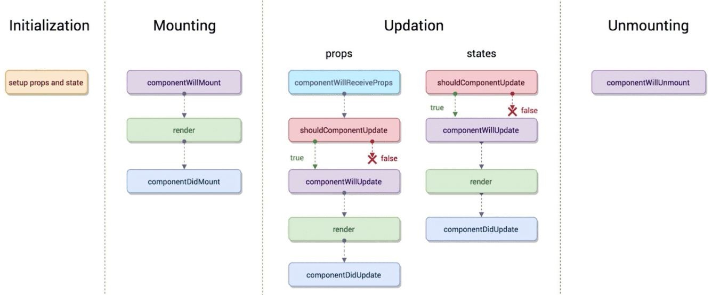
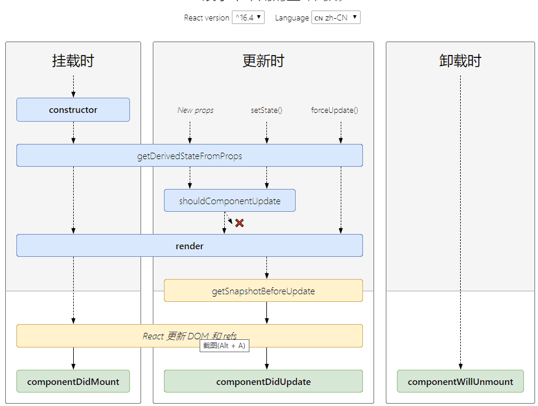

# react生命周期

每个组件都包含“生命周期方法”，你可以重写这些方法，以便于在运行过程中特定的阶段执行这些方法

## react16旧版生命周期函数

见下图：



### componentWillMount
* 执行场景：
	* 在render()方法之前
* 解释
	* 因为这个函数执行在render之前，所以在这个方法中执行setState不会重新渲染re-render
	* 这是服务器端渲染中的唯一调用的钩子
	
### render	 
* 执行场景
	* 在componentWilMount方法之后
	* 在componentWillReceiveProps之后
	
### componentDidMount
* 执行场景
	* 在render()方法之后
	* 解释
		* 这个方法会在render()之后立即执行；
		* 这里可以对DOM进行操作，这个函数之后ref变成实际的DOM
		
### componentWillReceiveProps(nextProps, preState)
* 执行场景
	* 在已经挂在的组件(mounted component)接收到新props时触发;	(简单说初始化的时候不会执行)
* 解释
  * 组件初次渲染时不会执行componentWillReceiveProps；
  * 当props发生变化时执行componentWillReceiveProps；
  * 在这个函数里面，旧的属性仍可以通过this.props来获取；
  * 此函数可以作为 react 在 prop 传入之后， render() 渲染之前更新 state 的机会。即可以根据属性的变化，通过调用this.setState()来更新你的组件状态，在该函数中调用 this.setState() 将不会引起第二次渲染。
  * 也可在此函数内根据需要调用自己的自定义函数，来对prop的改变做出一些响应。
	  如果你只是调用this.setState()而不是从外部传入props, 那么不会触发componentWillReceiveProps(nextProps)函数；这就意味着: this.setState()方法不会触发componentWillReceiveProps(), props的改变或者props没有改变就会触发这个方法;但是值得注意的是componentWillReceiveProps被调用了不一定意味着props的改变。
  [a=>b不等于b=>a](<https://reactjs.org/blog/2016/01/08/A-implies-B-does-not-imply-B-implies-A.html>)
  ```
  componentWillReceiveProps (nextProps:any) {
    this.setState({
      ...nextProps.recordProp
    })
  };
  ```
  上面实现的就是在componentWillReceiveProps中讲props的值复制给state,因为props是不允许被修改的（因为props一般是从父组件传递给子组件，这就需要保证props的不变性，确定所有的子组件都能获取相同的props值）。
  正是由于这个问题，在实现Input的双向绑定的时候，如果从父组件中传递给子组件，直接绑定到Input[value]，这个时候即使你输入不同的值，输入框的内容是不会更改的，因此我们需要有一个合适的地方（componentWillReceiveProps）中将props的值赋值给state。
### shouldComponentUpdate(nextProps, nextState)
* 执行场景
	* 在接收到新props或state时，或者说在componentWillReceiveProps(nextProps)后触发
* 解释
	* 在接收新的props或state时确定是否发生重新渲染，默认情况返回true，表示会发生重新渲染
	* 在首次渲染时或者forceUpdate()时不会触发;
	* 这个方法如果返回false, 那么props或state发生改变的时候会阻止子组件发生重新渲染;

### componentWillUpdate(nextProps, nextState)
* 执行场景
	* 在props或state发生改变或者shouldComponentUpdate(nextProps, nextState)触发后, 在render()之前	 
* 解释
	* 初始化时不会被调用
	* 不要在这个函数中调用this.setState()方法.会造成死循环
	* 如果确实需要响应props的改变，那么你可以在componentWillReceiveProps(nextProps)中做响应操作

### componentDidUpdate(prevProps, prevState, snapshot)
* 执行场景
	* 在发生更新或componentWillUpdate(nextProps, nextState)后	
* 解释： 
	* 使用这个方法可以对组件中的DOM进行操作
		 
### componentWillUnmount
* 执行场景
	* 在组件卸载(unmounted)或销毁(destroyed)之前
* 解释
	* 处理一些必要的清理操作，比如无效的timers、interval，或者取消网络请求，或者清理任何在componentDidMount()中创建的DOM元素(elements) 		 	 		 

### 组件生命周期执行过程 	
1）组件初始化

```
componentWillMount -> render -> componentDidMount
```
2）组件更新 – props change

```
componentWillReceiveProps -> 
shouldComponentUpdate -> 
componentWillUpdate -> 
render -> 
componentDidUpdate
```
3）组件更新 – state change

```
shoudlComponentUpdate -> 
componentWillUpdate -> 
render-> 
componentDidUpdate
```
4）组件卸载或销毁

```
componentWillUnmount
```

## 在react16时出现了新版的生命周期函数

见下图：



从上图可以看出新版生命周期函数中新增“static getDerivedStateFromProps”，“getSnapshotBeforeUpdate”这两个生命周期函数，去除了“componentWillReceiveProps”，“componentWillUpdate”，“componentWillMount”


### 关于static getDerivedStateFromProps(preProps, nextState)

>getDerivedStateFromProps 会在调用 render 方法之前调用，并且在初始挂载及后续更新时都会被调用。它应返回一个对象来更新 state，如果返回 null 则不更新任何内容。

值得说的是这是个静态方法，意味着组件对他是没有直接访问权限的，在里面不能直接通过this访问组件的state，props，methods；通过这个生命周期函数的名字就可以看出，他的作用就是将props的属性映射到state上。

他是componentWillReceiveProps的替代函数，如果state没做修改返回一个null，这个返回值是必须的，所以尽量将其写到函数的末尾。

此外必须了解的是getDerivedStateFromProps在父组件的re-render，以及组件的props修改之时会执行。

```
static getDerivedStateFromProps(nextProps, prevState) {
  const {type} = nextProps;
  // 当传入的type发生变化的时候，更新state
  if (type !== prevState.type) {
    return {
      type,
    };
  }
  // 否则，对于state不进行任何操作
  return null;
}
```

在新版生命周中官方建议使用getDerivedStateFromProps与componentDidUpdate一起使用去处理异步请求

```
// 在getDerivedStateFromProps中进行state的改变
static getDerivedStateFromProps(nextProps, prevState) {
  if (nextProps.type !== prevState.type) {
    return {
      type: nextProps.type,
    };
  }
  return null;
}
// 在componentDidUpdate中进行异步操作，驱动数据的变化
componentDidUpdate() {
    this._loadAsyncData({...this.state});
}
```

### 关于getSnapshotBeforeUpdate(prevProps, prevState)

>getSnapshotBeforeUpdate() 在最近一次渲染输出（提交到 DOM 节点）之前调用。它使得组件能在发生更改之前从 DOM 中捕获一些信息（例如，滚动位置）。此生命周期的任何返回值将作为参数传递给 componentDidUpdate()。

```
 getSnapshotBeforeUpdate(prevProps, prevState) {
    // 我们是否在 list 中添加新的 items ？
    // 捕获滚动​​位置以便我们稍后调整滚动位置。
    if (prevProps.list.length < this.props.list.length) {
      const list = this.listRef.current;
      return list.scrollHeight - list.scrollTop;
    }
    return null;
  }

  componentDidUpdate(prevProps, prevState, snapshot) {
    // 如果我们 snapshot 有值，说明我们刚刚添加了新的 items，
    // 调整滚动位置使得这些新 items 不会将旧的 items 推出视图。
    //（这里的 snapshot 是 getSnapshotBeforeUpdate 的返回值）
    if (snapshot !== null) {
      const list = this.listRef.current;
      list.scrollTop = list.scrollHeight - snapshot;
    }
  }
```

### 为什么要替换掉componentWillReceiveProps？

在新版react中使用的是react fiber的概念来进行任务处理

>把一个耗时长的任务分成很多小片，每一个小片的运行时间很短，虽然总时间依然很长，但是在每个小片执行完之后，都给其他任务一个执行的机会，这样唯一的线程就不会被独占，其他任务依然有运行的机会。因为一个更新过程可能被打断，所以React Fiber一个更新过程被分为两个阶段(Phase)：第一个阶段Reconciliation Phase和第二阶段Commit Phase。

在第一阶段Reconciliation Phase，React Fiber会找出需要更新哪些DOM，这个阶段是可以被打断的；但是到了第二阶段Commit Phase，那就一鼓作气把DOM更新完，绝不会被打断。

这两个阶段大部分工作都是React Fiber做，和我们相关的也就是生命周期函数。
以render函数为界，第一阶段可能会调用下面这些生命周期函数，说是“可能会调用”是因为不同生命周期调用的函数不同。

componentWillMount

componentWillReceiveProps

shouldComponentUpdate

componentWillUpdate


下面这些生命周期函数则会在第二阶段调用。

componentDidMount

componentDidUpdate
 
componentWillUnmount

因为第一阶段的过程会被打断而且“重头再来”，就会造成意想不到的情况。

[React Fiber是什么](<https://zhuanlan.zhihu.com/p/26027085>)

[你应该知道的requestIdleCallback](<https://juejin.im/post/5ad71f39f265da239f07e862>)

[生命周期示意图](<http://projects.wojtekmaj.pl/react-lifecycle-methods-diagram/>)

[官网描述](<https://zh-hans.reactjs.org/docs/react-component.html#mounting>)