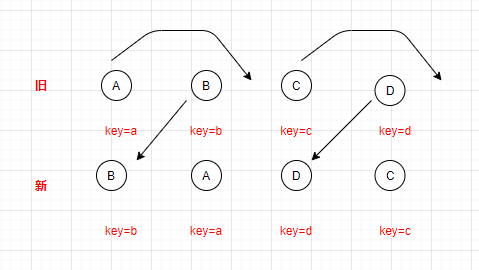

# react的diff过程

- Web UI 中 DOM 节点跨层级的移动操作特别少，可以忽略不计。

- 拥有相同类的两个组件将会生成相似的树形结构，拥有不同类的两个组件将会生成不同的树形结构。

- 对于同一层级的一组子节点，它们可以通过唯一 id 进行区分。

**react的diff分三个策略：tree diff, component diff, element diff**

## tree diff

对树的分层比较，两个树只对同一层节点进行比较；如果节点不存在
则该节点及其子节点完全被删除，不会进行下一步的比较。

## component diff

- 同一类型组件，按照层级比较Virture DOM树；如能知道组件没有发生变化，能节省大量
计算时间。（通过shouldComponentUpdate，React.memo）

-  不同类型的组件直接替换新建。

## element diff

对同一层级的一组子节点，通过id区分

当节点处于同一层级时，diff提供了三种节点操作：**删除，插入，移动**

em：现已存在集合（A,B,C,D）

- 插入

新的节点E不在集合中，需要将其插入

- 删除

现在的新的集合成了（A,B）,组件D不在其中了需要对其进行删除

- 移动

新的集合变成了（A,D,B,C）, D只是位置发生了更新。

如果没有添加唯一的key值，这时候需要使用旧的集合的B与新集合D进行比较，删除第二个位置的B，再将D插入到第二个位置

但是如果使用了唯一的key，则只需将B，D位置替换即可。

>（1）看着上图的 B，React先从新中取得B，然后判断旧中是否存在相同节点B，当发现存在节点B后，就去判断是否移动B。
B在旧 中的index=1，它的lastIndex=0，不满足 index < lastIndex 的条件，因此 B 不做移动操作。此时，一个操作是，lastIndex=(index,lastIndex)中的较大数=1.

>（2）看着 A，A在旧的index=0，此时的lastIndex=1，满足index<lastIndex，对A进行移动操作，此时lastIndex=max(index,lastIndex)=1。

>（3）看着D，同（1），不移动，由于D在旧的index=3，比较时，lastIndex=1，所以改变lastIndex=max(index,lastIndex)=3

>（4）看着C，同（2），移动，C在旧的index=2，满足index<lastIndex（lastIndex=3），所以移动。

[React 源码剖析系列 － 不可思议的 react diff](https://zhuanlan.zhihu.com/p/20346379)