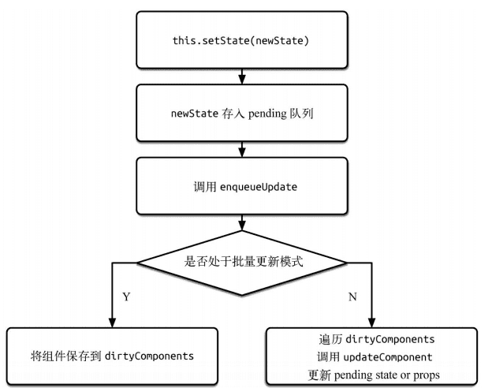

# 对setState的理解

### 1.setState的异步机制？
```
class Root extends React.Component {
  constructor(props) {
    super(props);
    this.state = {
      count: 0
    };
  }
  componentDidMount() {
    let me = this;
    me.setState({
      count: me.state.count + 1
    });
    console.log(me.state.count);    // 打印
    me.setState({
      count: me.state.count + 1
    });
    console.log(me.state.count);    // 打印
    setTimeout(function(){
     console.log(me.state.count);   // 打印
    }, 0);
    setTimeout(function(){
     me.setState({
       count: me.state.count + 1
     });
     console.log(me.state.count);   // 打印
    }, 0);
    setTimeout(function(){
     me.setState({
       count: me.state.count + 1
     });
     console.log(me.state.count);   // 打印
    }, 0);
  }
  render() {
    return (
      <h1>{this.state.count}</h1>
    )
  }
}
```
>答案： 0, 0, 1, 2, 3

执行setState并不能立即获得我们的期望state值，因为setState是异步执行的，并不会立即执行，所以不能同步获取，并且正是因为他的异步，所以多次连续的执行setState，只会执行最后一次的setState。
this.setState((
  target: newValue
), () => {
  console.log(this.state,target);
})
why?：但是问题是为啥在setTimeout/setInterval中却能同步获取我们想要的值呢？
reason：在React内部机制能检测到的地方， setState就是异步的；在React检测不到的地方（非合成事件，非生命周期中），例如setInterval,setTimeout，原生事件里，setState就是同步更新的。

### 2.setState更新状态的机制？
this.setState()不仅会改变组件的当前状态【返回一个新状态，使用了Object.assign(),将已修改的属性添加进去，而不是覆盖】，还会触发组件的render(),更新view

### 3.setState更新状态总是会触发render()刷新视图吗？
会，每一个setState如果不做特殊操作都会触发视图的更新（无论值是否改变）， 因为componentWillUpdate -> shouldComponentUpdate(nextProps, nextState) 默认是返回true -> render ; 因此可以可以在shouldComponentUpdate中进行react优化（判断this.state与nextState是否相等）

### 4.多次执行this.setState()的操作， 而且都是同一属性修改最终会以那次为准？
setState的批量优化更新优化只是建立在"异步"(合成事件，钩子函数)上， 在原生事件和setTimeout中不会批量更新；多次连续对同一个值执行setSate,setState的批量更新策略会对其进行覆盖，取最后一次的执行，如果是同时setState多个不同的值，在更新时会进行合并批量更新。

```
 this.state = {
	testCount: 1
 };
 componentDidMount () {
    this.setState({
      testCount: 1+ this.state.testCount,
    });
    
    this.setState({
      testCount: 2 + this.state.testCount,
    });
    this.setState({
      testCount: 3 + this.state.testCount,
    });
    setTimeout(() => console.log(this.state.testCount))
  };
```
>结果：4

### 5.setState为啥要设计成异步？

前提：首先需要确认的是延时setState对状态变动进行批量更新可以提升执行效率
setState异步执行，等待其他变动一起修改state，然后同步渲染view
> <strong>保证内部的一致性:</strong>
> 即使state可以同步更新，但是props也不能。试想一种情况：子组件通过props获 取父组件的state上的属性值。因为上述前提的存在，即使state的同步更新，也不会频繁触发视图的更新，使得props不能同步state的值，导致父组件中的state值与子组件中的props值不相同的情况。
 
个人觉得是为了提升执行效率而带来的结果
> <strong>异步更新使得并发更新组件成为可能：</strong>
> 首先我们在这里讨论是否同步刷新state有一个前提那就是我们默认更新节点是遵循特定的顺序的。但是按默认顺序更新组件在以后的react中可能就变了。
举个例子：比如你现在正在打字，那么TextBox组件需要实时的刷新。但是当你在输入的时候，来了一个信息，这个时候，可能让信息延后刷新可能更符合交互。

这个理由，可能是react发展的一个方向，目前还没有实现。

### 6.简单说下setState的异步原理？

当调用setState时候，实际上使用enqueueSetState方法对partialState和_pendingStateQueue更新队列进行合并操作，最终通过enqueueUpdate执行state更新。
```
enqueueSetState: function(publicInstance, partialState) {
 var internalInstance = getInternalInstanceReadyForUpdate(
 publicInstance,
 'setState'
 );
 if (!internalInstance) {
 return;
 }
 // 更新队列合并操作
 var queue = internalInstance._pendingStateQueue || (internalInstance._pendingStateQueue = []);
 queue.push(partialState);
 enqueueUpdate(internalInstance);
}, 
```


关于enqueueUpdate的简单源码实现“
```
function enqueueUpdate(component) {
  ensureInjected();
  // 如果不处于批量更新模式
  if (!batchingStrategy.isBatchingUpdates) {
    batchingStrategy.batchedUpdates(enqueueUpdate, component);
    return;
    }
    // 如果处于批量更新模式，则将该组件保存在 dirtyComponents 中
    dirtyComponents.push(component);
  }
}
```
如果 isBatchingUpdates 为 true，则对所有队列中的更新执行 batchedUpdates 方法，否则只
把当前组件（即调用了 setState 的组件）放入 dirtyComponents 数组中。

### 7.为什么react需要shouldComponentUpdate而vue不需要？？

因为react是diff dom, vue是diff数据，在react中整个框架并不能自己知道数据是否发生了变化，只能通过开发者手动的setState，然后react内部将这个动作放入_penddingStateEquenu中，然后在循环执行，
然后对应的就是虚拟dom的修改，通过diff算法去更新dom；但是在vue中每当数据的修改都会触发对象属性描述方法set，进而就会触发一个notify(如果没做修改则不会触发)，然后去创建虚拟dom，进而更新视图。
总体描述：在react中是开发者手动去setSate继而更新视图，vue中只要数据变了就会触发视图更新，他们的实现方式也就注定了这个api的存在与否。

[参考文档](<https://www.zhihu.com/question/266656197>)

<https://github.com/facebook/react/issues/11527>

<https://juejin.im/post/5a6f440a51882573336652af>

<https://www.jianshu.com/p/cc12e9a8052c>