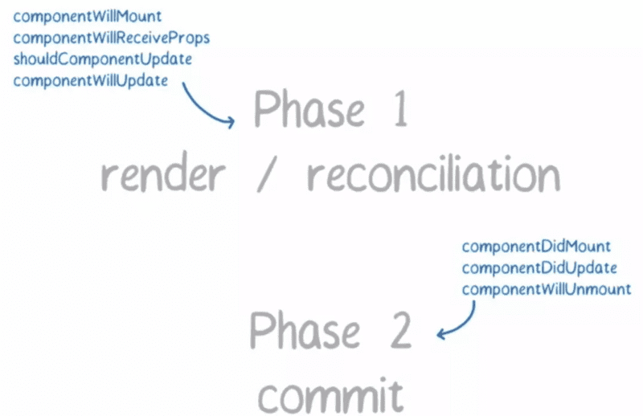

# 浅谈react-fiber

## fiber所需要解决的问题？

- 背景：ui渲染引擎，与js解析引擎是互斥的，如果js逻辑过于复杂，执行时间过长就会使得ui迟迟不得渲染，表现效果就是网页卡顿，尤其是单线程的js；在react如果项目过大，组件过多，每一次的props或者setState/useState引起的render都会使得组件重新渲染，而每一次的渲染都需要虚拟dom的diff，其中设计到大量的js计算，如此一来就会有很大概率造成ui渲染卡顿了，用户操作卡顿。

- react-fiber的思想就是任务切片，在旧版本react(v15)使用是递归的方式进行渲染，使用的是js引擎自身的函数调用栈，以经开始就不能暂停； 而Fiber实现自己的组件调用栈，以链表的形式遍历组件树，可以做到灵活的暂停，继续，和丢弃执行的任务， 每执行一段时间，都会将控制权交回给浏览器。
实现方式就是使用**requestIdleCallback**

> window.requestIdleCallback()会在**浏览器空闲时期依次调用函数**，这就可以让开发者在主事件循环中**执行后台或低优先级**的任务，而且不会对像动画和用户交互这些延迟触发但关键的事件产生影响。

## React 框架内部的运作可以分为 3 层：

- Virtual DOM 层，描述页面长什么样。
- Reconciler 层，负责调用组件**生命周期方法**，进行 Diff 运算等。
- Renderer 层，根据不同的平台，渲染出相应的页面，比较常见的是 ReactDOM 和 ReactNative。

改动最大的就是Reconclier，React 团队也给它起了个新的名字，叫Fiber Reconciler。这就引入另一个关键词：Fiber。

既然在浏览器空闲的时候就执行优先级低的任务，那么在这之前是需要将任务进行优先级分配，

为了达到这种效果，就需要有一个调度器 (Scheduler) 来进行任务分配。任务的优先级有六种：

- synchronous，与之前的Stack Reconciler操作一样，同步执行
- task，在next tick之前执行
- animation，下一帧之前执行
- high，在不久的将来立即执行
- low，稍微延迟执行也没关系
- offscreen，下一次render时或scroll时才执行

**优先级高的任务（如键盘输入）可以打断优先级低的任务（如Diff）的执行，从而更快的生效。**

## react-fiber导致react的生命周期必须作出变更的主要原因

Fiber Reconclier执行过程可分为两个阶段



- 阶段一：生成Fiber树，得出需要更新的节点信息。这个过程是一个渐进的过程，可以被打断，对于打断的则会重新执行。
- 阶段二：将需要更新的节点一次批量更新，这个过程不能打断。

在react中开发人员会在will-*类型的生命周期中做很多，初始化工作，以及接口调用，那么这在Fiber架构中就造成想不到问题。
因此react官方更改了生命周期。

## 对比vue

react底层实现不是对数据的侦测来驱动视图的更新（数据发生改变了就去更新视图），因此每一次的setState/useState，或者父组件的更新都会导致react组件的重新render，生成新的虚拟dom与旧的虚拟dom对比，找出需要更新的地方，这种实现导致了开发人员必须追踪state的变更，如果有变更就需手动setStat，如若没有则需要使用shouleComponentUpdate/pureComponent以及第三方immutable.js来避免对于的dom diff, 进而提升性能。仔细想想如果开发者能够很好的避免无用的render，那么react是不是不需要 fiber呢？

## 对比sevlte

sevlte相比react,vue而言，速度更快，体积更小，react,vue都是runtimer运行时的框架，在webpack打包的时候，会将框架源码打包进bundle.js，这也就说明即使我们的应用及其简单，我们的首页资源都会有几十kb的大小；但是sevlte实现的思路就有所不同，它更像是一个编译工具，Svelte组件编译了以后，所有需要的运行时代码都包含在里面了，除了引入这个组件本身，你不需要再额外引入一个所谓的框架运行时！

- Svelte 的编译风格是将模板编译为命令式 (imperative) 的原生 DOM 操作

```
这样的输出不需要 Virtual DOM 的 diff/patch 操作，自然可以省去大量代码，同时内存占用更是极佳。
```
但是如果项目较大，大量动态内容，以及组件嵌套的，如何做到最小粒度的视图更新，将是它的一个问题。不使用虚拟dom也导致它在服务器与渲染这块的功能上也很棘手。

[如何看待svelte](https://www.zhihu.com/question/53150351)

https://segmentfault.com/a/1190000018250127

https://www.youtube.com/watch?v=ZCuYPiUIONs

[走进react-fiber的世界](https://mp.weixin.qq.com/s/zjhCIUtJrSmw2icy2zkKFg)
