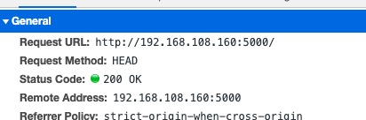
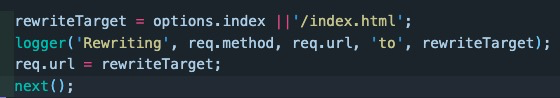

# 路由hash模式与history

## 路径显示的区别

hash模式浏览器地址栏会多一个“#”，

```
http://179.123.108.160:5000/#/view_detail
```
每一次页面的变更都对应这个“#”后面的路径变化，而history模式没有这个“#”。

## 刷新页面history模式会出现404的问题

原因是刷新浏览器之后，浏览器会根据这个地址向对应的服务器去重新请求资源，“#”（hash是不会包含在请求路径之中的），
所以使用hash值的时候总是定位在index.html，然后再由vue-router做页面更新处理；但是如果是history模式的时候，请求
路径机会是一个完整的路径地址，但是但页面应用只有一个index.html，所以会寻找不到返回404 error。

- history模式

形如这样的请求： ‘http://192.168.108.160:5000/view_agreement‘

结果：


因为服务器上不存在这个http://192.168.108.160:5000/view_agreement这个资源

- hash模式

形如这样的请求：'http://192.168.108.160:5000/#/view_agreement'

结果： 



对比上面的结果可以清晰看到，hash模式在请求资源的时候是不会携带hash值的

## 为什么浏览器的前进后退不会触发404的问题？？

因为前进后退调用的是window.history.go/back方法，会在页面的history栈中获取历史记录，并不会触发页面重新加载这个文件资源

## 怎么解决history模式的404问题？？

nodeJS怎么解决这个问题了？

解决方案：

```
const history = require('connect-history-api-fallback');
app.use(history());
```
只需要上面这个api就可以了，其实现原理我们可以看看这个中间件的实现源码。

源码思路是使用中间件，拦截所有页面请求，判断请求类型(根据请求方法，以及请求header去判断)
找到页面路径请求，然后重定向，指向index.html(入口页面)，剩下的工作就是vue-router/react-router
去根据路径匹配对应的组件，页面更新。



## java等其处理方式

其实不关是java，还是php等，我们只需要在页面资源找不到返回404之前，将其重定向到index.html，都可以解决这个问题


