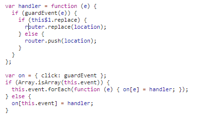

# vue router参数解析，以及怎么匹配组件

## vue router的路径解析

- 初始化的时候

```
function getLocation (base) {
  var path = decodeURI(window.location.pathname);
  if (base && path.indexOf(base) === 0) {
    path = path.slice(base.length);
  }
  return (path || '/') + window.location.search + window.location.hash
}
```
在路由初始化的时候(VueRouter.prototype.init中)，需要vueRouter自动解析地址信息，获取当前的路由信息，将对应的组件显示在页面上。

- 通过导航切换

使用this.$router.push方法进行路由切换时
```
this.$router.push('/')
```
以及使用router-link导航时



都是会将对应的路由名字或者路径传入，
接下来就是需要按照这个值去找到对应的组件信息

## 获取路径对应的组件

在VueRouter初始化的时候会，执行
```
  this.matcher = createMatcher(options.routes || [], this);
```
createMatcher中的createRouteMap方法会对routes路由配置进行遍历，形成pathList（路径集合），pathMap（路径key与组件信息val的对象）
nameMap（路由名key与组件信息val的对象）

```
// createRouteMap 代码片段

routes.forEach(function (route) {
  addRouteRecord(pathList, pathMap, nameMap, route);
});
.....
..... 
return {
  pathList: pathList, // 所有路由路径path集合
  pathMap: pathMap,   // 所有path - 组件信息record形成的对象
  nameMap: nameMap    // 所有name - 组件信息record形成的对象
}
```

每一次的路由更新都是调用this.$transitionTo方法，其中调用了
 this$1.updateRoute(route)更新了this.current = route;
 
```
History.prototype.updateRoute = function updateRoute (route) {
  var prev = this.current;
  this.current = route; 
  this.cb && this.cb(route); 
  this.router.afterHooks.forEach(function (hook) {
    hook && hook(route, prev);
  });
};
```
在组件RouterView中根据current获取对应的组件信息，然后重新渲染

### 到目前为止我们已经能正确获取到当前路由的对应组件信息，那怎么实现，routerView的视图更新呢？？

先看
```
Vue.mixin({
  beforeCreate: function beforeCreate () {
    if (isDef(this.$options.router)) {
      this._routerRoot = this;
      this._router = this.$options.router;
      this._router.init(this); 
      Vue.util.defineReactive(this, '_route', this._router.history.current);
    } else {
      this._routerRoot = (this.$parent && this.$parent._routerRoot) || this;
    }
    registerInstance(this, this);
  },
  ....
  .....
});
```

这里可以很清楚的看到将vue的“_route”属性定义为响应式的，因此这个“_route”只要发生改变就会触发视图的的更新

this.cb && this.cb(route); 的实现关键代码

```
// 定义listen
History.prototype.listen = function listen (cb) {
  this.cb = cb;
};

// init中调用

history.listen(route => { // 
  this.apps.forEach((app) => { // apps是vue实例
    app._route = route
  })
})
```

**router-view的核心代码**

```
// 这里这是关键代码
var route = parent.$route;
var matched = route.matched[depth];
var component = cache[name] = matched.components[name];
```
重新渲染
```
.....
return h(component, data, children)
```

 


## 自己实现一个简易的vue-router

[自己写一个vue-router](https://juejin.im/post/5e5b6906518825492a7207b4)