# vue知识点

## 简单说下mvc, mvvm 

- mvc 

mvc这种设计模式来源于后端开发，v（view）用于控制视图结构展示，c（controller）用于对接视图的响应,业务逻辑处理，m（model）用于数据库数据处理；对应到前端m的作用发生了改变，在前端m主要负责数据模型变化响应到view；
mvc的所有通信都是单向的。

- mvvm

v（view）视图的变更会触发vm（viewModel）的监听事件去修改数据模型model；model的数据更改会触发vm的数据绑定进而驱动v的更新。

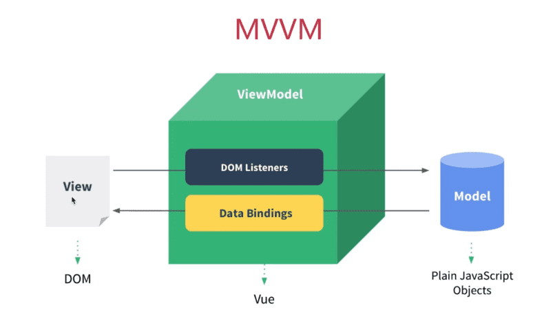

## vue响应式数据原理

组件data中定义的属性，在组件初始化的时候会对data进行深层遍历，对每一个属性使用Object.defineProperty执行getter/setter转化，
每一个属性都有一个watcher实例，会在渲染过程中为数据属性记录依赖，如果属性值发生改变则会触发setter函数，依赖数组执行notify函数通知watcher，watcher会执行相关compiler函数进而触发关联组件的重新渲染。

[深入理解vue响应式原理](https://cn.vuejs.org/v2/guide/reactivity.html#ad)

[我的第一个vue实现-evel-vue](https://github.com/Arrayeval/evel-vue/tree/master/vue-coding)

使用Object.defineProperty写一个简单的双向绑定

```
<input type="text" id='nameEl'>
<span id='nameShow'></span>  
<script>
  var obj = {};
  Object.defineProperty(obj, 'name', {
    set: function(newVal) {
      document.getElementById('nameEl').value = newVal;
      document.getElementById('nameShow').innerHTML = newVal;
    }
  });

  document.addEventListener('keyup', function(e) {
    obj.name = e.target.value;
  })
</script>
```
使用proxy实现一个简单的双向绑定

```
<input type="text" id='nameEl'>
<span id='nameShow'></span>  
<script>
  var obj = {};
  
  let infoData = new Proxy(obj, {
    set: function(obj, prop, value) {
      document.getElementById('nameEl').value = newVal;
      document.getElementById('nameShow').innerHTML = newVal;
    }
  })

  document.addEventListener('keyup', function(e) {
    obj.name =  e.target.value;
  })
</script>
```

## vue如何检测数组的变化

上面已经讲解了vue使用Object.defineProperty对对象属性进行了数据劫持添加setter方法，实现响应式是数据的过程；对于数组这种特殊的数据类型是不能通过上面的方法实现的。

**具体实现思路：** 

1. 对数组的每个元素添加数据依赖

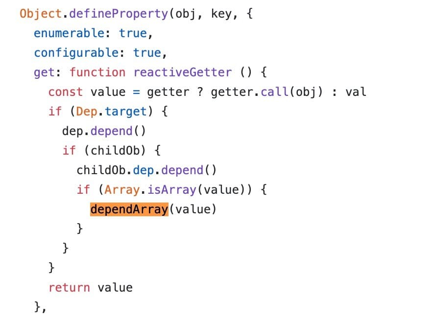

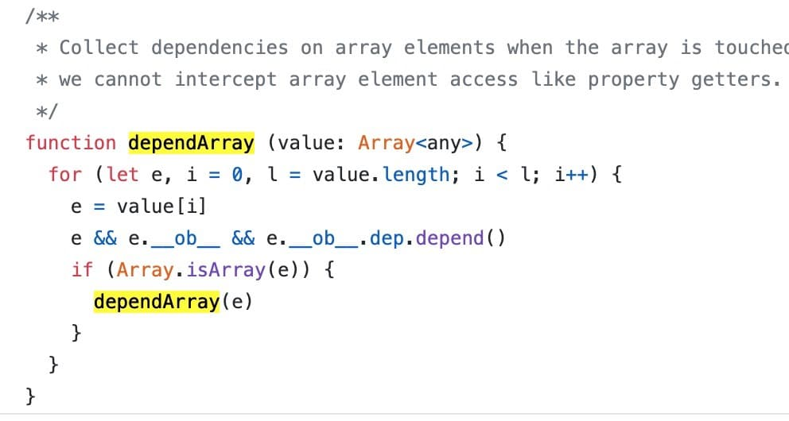


因此vue提供了几个数组的编译方法：

> push(), pop(), shift(), unshift(), splice(), sort(), reverse()

在vue中对这几个方法做了特殊处理，

```
const methodsToPatch = [
  'push',
  'pop',
  'shift',
  'unshift',
  'splice',
  'sort',
  'reverse'
];
methodsToPatch.forEach(function (method) {
  // cache original method
  const original = arrayProto[method]
  def(arrayMethods, method, function mutator (...args) {
    const result = original.apply(this, args)
    const ob = this.__ob__
    let inserted
    switch (method) {
      case 'push':
      case 'unshift':
        inserted = args
        break
      case 'splice':
        inserted = args.slice(2)
        break
    }
    if (inserted) ob.observeArray(inserted)
    // notify change
    ob.dep.notify()
    return result
  })
})
```
[vue重新定义数组变异方法的源码](https://github.com/vuejs/vue/blob/52719ccab8fccffbdf497b96d3731dc86f04c1ce/src/core/observer/array.js)

对比与对象处理过程的不同点，只是在数据劫持处理这点有所不同，对象属性改变会触发setter方法进而触发依赖数组的notify方法，再触发watcher去执行complile函数更新对应的组件视图；对于数组是通过变异方法去更新数组，进而触发依赖数组的notify方法，再触发watcher去执行complile函数更新对应的组件视图。

**data是一个返回对象的函数，为什么要这样设计？**

- 每一次都返回一个新的data对象，避免同一个组件多次使用时数据相互影响。(同一个页面使用某个组件多次)

- 如果是是一个对象也方便vue去做数据劫持

**为什么改变数组length，或者通过下标增加新值，或者为已经初始化的对象通过".value"形式增加一个新属性不会触发视图的更新？**

原因就是没有触发dep.notify()，不能通知到watcher去执行更新视图相关操作。因此为了能使得数据更新驱动视图的更新我们必须要触发对象属性的setter方法，或者对数组使用变异方法。

```
// 重新赋值触发setter方法
vm.userProfile = Object.assign({}, vm.userProfile, {
  age: 27,
  favoriteColor: 'Vue Green'
})

// 重新赋值触发setter方法
arr = [1,2,3,4]; 
// 或者 使用变异方法
arr.push(4);
```

## vue中异步渲染，以及异步渲染的原因

> vue在更新dom的时候是异步执行的，只要监听到数据变化，vue将开启一个队列，并缓冲在同一事件循环中发生的所有数据变更，如果同一个watcher被触发多次只会推入到队列一次；如果数据没有发生改变是不会触发watcher的；这样做的目的是为了减少不必要的计算和DOM操作；当刷新队列时组件会在下一个事件循环“tick”中更新。

一个帮助分析的例子：
```
<template>
 <div>
   <div ref="message">{{message}}</div>
   <button @click="fn">点击</button>
 </div>
</template>

export default {
  data () {
    return {
      message: 123
    };
  },
  methods () {
    fn () {
      this.message = 456;
      console.log(this.$refs.message.innerHTML);
      this.$nextTick(function(){ //或者Vue.nextTick
        console.log(this.$refs.message.innerHTML);
      });
    }
  }
}
```
> 结果分析：123， 456

产生以上的原因vue异步渲染导致的

## nextTick的作用

用法：在下次DOM更新循环结束之后执行延迟回调。在修改数据之后立即使用这个方法，获取更新后的DOM。

使用场景：常见与数据更新之后立即获取DOM的案例，created中获取dom节点。

> Vue 在内部尝试对异步队列使用原生的Promise.then 和MutationObserver，如果执行环境不支持，会采用setTimeout(fn, 0)代替。

[nextTick的源码](<https://github.com/vuejs/vue/blob/d7d8ff06b70cf1a2345e3839c503fdb08d75ba49/src/core/util/next-tick.js>)

## vue组件生命周期，以及各做了什么事情

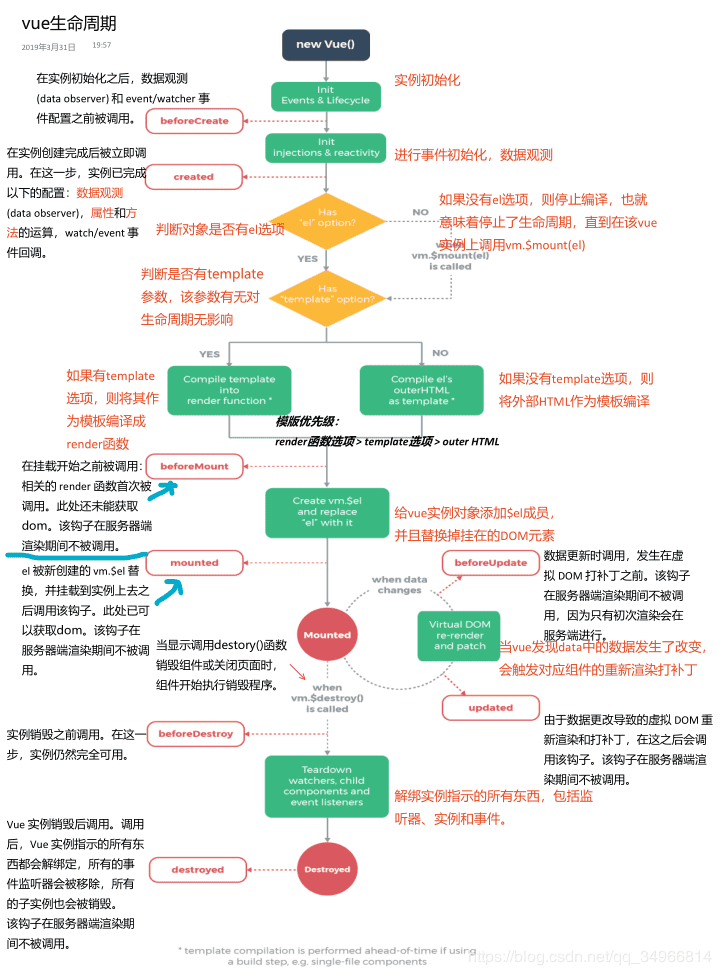

**new vue** 

生成vue实例

**beforeCreate**

生成$options选项，给实例添加生命周期相关属性

**created**

从$options获取数据选项，遍历methods选项，给数据添加依赖，定义getter，setter属性；这个阶段可以访问到data属性，使用methods。

**beforeMount**

将HTML解析成AST节点，根据AST节点生成渲染树，render函数首次被调用。

**mounted**

执行render函数生成虚拟DOM，创建真实dom替换虚拟dom并挂载实例，此时可以操作dom。

**beforeUpdate** 

data数据更新之后，虚拟dom重新渲染之前被调用，此时修改data不会附加渲染过程。

**updated** 

虚拟dom重新渲染之后被调用，此时修改data会触发死循环。

**beforeDestory**

组件实例销毁之前被调用，常用于开发者手动释放内存，清除事件监听，例如setTimeout, setInterval, 以及其第三方库的释放。

**destroyed**

实例销毁之后调用，清除事件监听，释放变量内存。

分别在每个生命beforeCreate, created, beforeMount, mounted阶段执行下面的输出

```
console.log(this)
console.log(this.$data)
console.log(this.$el)
```
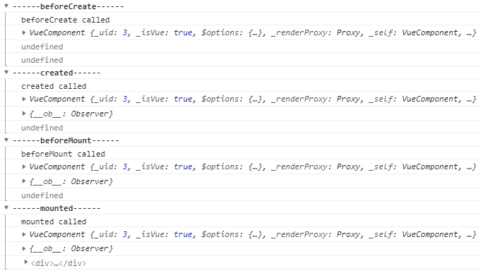

[源码](https://github.com/vuejs/vue/blob/dev/src/core/instance/lifecycle.js)

[每个生命周期做了什么](https://blog.csdn.net/weixin_34050005/article/details/87964047)

## ajax请求应该放在哪个生命周期中？

数据请求回来会之后会使用到data对象，只有在created生命周期之后才可以拿到data对象，因此可以放在data中，
不能放在beforeCreate中；如果在异步请求中会涉及到DOM操作，那么建议放在mounted生命周期中；但是不要放在
updated中，因为会造成死循环。

## vue的computed与函数的区别，实现原理？

> 计算属性会依据他的响应式依赖进行缓存，只要响应式依赖发生了改变才会重新求新值。

```
computed: {
  now: function () {
    return Date.now()
  }
}
```
上面的例子不会触发更新，因为他的依赖不是响应式的。

**相比函数的优点：** 不需要手动调用，并且计算属性是有缓存的。

**计算属性的setter** 

计算属性的默认只有一个getter，如果你需要手动修改计算属性必须提供一个setter方法。

[计算属性的setter](<https://cn.vuejs.org/v2/guide/computed.html#%E8%AE%A1%E7%AE%97%E5%B1%9E%E6%80%A7%E7%9A%84-setter>)

**computed的实现以及缓存原理**

关于computed的实现，**源码如下**

在初始化的时候使用的是initComputed方法进行初始化

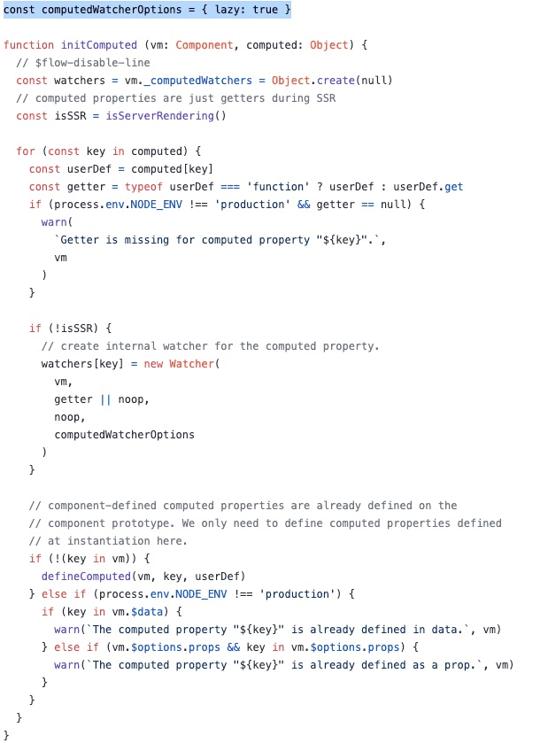

从上图可以看出：
- 不支持服务器渲染
- computed中定义的属性不能在data中出现

另外从上面可以看到，是为computed的每一个属性添加了监听，进而可通知模版编译
```
 watchers[key] = new Watcher(
    vm,
    getter || noop,
    noop,
    computedWatcherOptions
  )
```
让我们接着看**defineComputed**

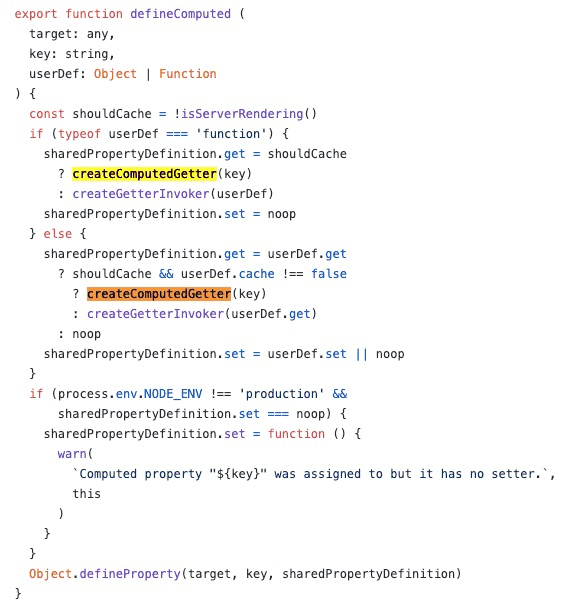

定义了每一个变量的sharedPropertyDefinition.get(及在获取值的时候会触发)，在其中使用createComputedGetter

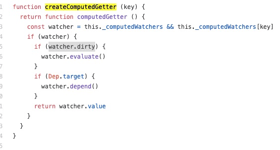

如果watcher.dirty===true，则最终是调用watcher的evaluate方法返回值，而不会去触发依赖更新，这就是computed的缓存机制。

## watch中的deep:true作用，及实现原理？

> 用于观察vue实例上的一个表达式或者函数计算结果的变化，回调函数返回新值或者旧值。

**选项：**

- deep：表示是否深度监听

- immediate：表示是否立即触发回调

```
watch: {
  firstName: {
    handler(newName, oldName) {
      this.fullName = newName + ' ' + this.lastName;
    },
    // 代表在wacth里声明了firstName这个方法之后立即先去执行handler方法
    immediate: true,
    deep: true,
  }
}
```
**deep:true的实现原理**

如果检测到deep:true，则会对当前监听的值进行遍历处理为每个值添加依赖。

```
const seenObjects = new Set()
// 内部递归时会传入seen参数，用于保存seen中已经存在的数据
function traverse (val, seen) {
  let i, keys
  if (!seen) {
    // 如果没有配饰seen，把它指向seenObjects，并清空内容
    seen = seenObjects
    seen.clear()
  }
  const isA = isArray(val)
  const isO = isObject(val)
  if (isA || isO) {
    // 如果当前值有Observer
    if (val.__ob__) {
      // 拿到当前值的Observer的订阅者管理员的id
      var depId = val.__ob__.dep.id
      // 如果seen中已经有这个id了，直接返回
      if (seen.has(depId)) {
        return
      } else {
        // 否则添加到seen中
        seen.add(depId)
      }
    }
    // 递归数组
    if (isA) {
      i = val.length
      // 触发数组内部元素的get，因为此时Dep.target依然引用了当前Watcher，因此数组内部元素的Observer的订阅者管理员中也会被加入当前订阅者从而达到深度监听的目的
      while (i--) traverse(val[i], seen)
    // 递归对象
    } else if (isO) {
      keys = Object.keys(val)
      i = keys.length
      while (i--) traverse(val[keys[i]], seen)
    }
  }
}
```
[watch源码](https://github.com/vuejs/vue/blob/4f111f9225f938f7a2456d341626dbdfd210ff0c/src/core/observer/watcher.js)

## vue事件绑定的原理？

vue中通过v-on指令绑定的Dom事件都是最终都是通过el.addEventListener(event, cb, useCapture)进行绑定的。

对于v-on自定义事件，以及通过$emit，$on派发的事件都是同事事件订阅的方式实现的。

[Vue源码解读-方法与事件绑定](https://defed.github.io/Vue%E6%BA%90%E7%A0%81%E8%A7%A3%E8%AF%BB-%E6%96%B9%E6%B3%95%E4%B8%8E%E4%BA%8B%E4%BB%B6%E7%BB%91%E5%AE%9A/)

**关于事件订阅的简单实现：**

定义一个事件对象，存储形式就是事件名为key，事件函数组成的数组为值。

```
let eventsList = {
  'shift': [fun1(), fun2()],
  'getData': [fun2(), fun3()],
};
```
$on作用就是向这个对象中添加事件

```
function $on(type, fn) {
  if (!eventList[type]) {
    eventList[type] = [];
  }
  eventList[type].push(fn);
}
```
$emit做用就是触发这个事件

```
function $emit() {
  let type = Array.prototype.shift.call(arguments);
  let onFunctions = eventList[type];
  if (onFunctions && onFunctions.length > 0) {
    for(let i = 0, fn; fn = onFunctions[i++];) {
      fn.apply(this, arguments);
    }
  }
}
```
[$emit, $on的实现思路](https://www.jianshu.com/p/3046f663e45f)

## vue组件如何通信？

- 父子组件的通信：props传递属性，自定事件，$emit,$on订阅，通过$ref,$parent,$children获取组件实例获取属性。

[组件之间通信](https://www.cnblogs.com/evaling/p/7242567.html)

- 兄弟之间的通信：中央事件总线。

[中央事件总线](https://www.cnblogs.com/evaling/p/9192728.html)

- 全局：vuex状态管理

[vux状态管理](https://www.cnblogs.com/evaling/p/7291573.html)

- 如果是跨组件之间的相互通信，例如高阶组件，可以使用$attrs获取祖组件的属性, $listeners触发祖组件的事件

[listeners, attrs的使用](https://github.com/EvalGitHub/vue-study/blob/master/src/components/child.vue)

## 什么是作用域插槽？

插槽使用与扩充组件内容，使用形式是在父组件中使用子组件，在子组件开始结束标签之前传递内容，只是一种父组件定义子组件内容的行为，但是有时候我们需要在父组件中使用到这个子组件的内容，一般来说如果不通过组件之间的通信是无法做的的，但是我们可以使用作用域插槽。

子组件：baseLayout.vue

```
<template>
  <article>
    <main>
      <slot name="default" v-bind:userInfo="userInfo">
        {{userInfo.defaultSlot.name}}
      </slot>
    </main>
    <footer>
      <slot name="footer"></slot>
    </footer>
  </article>
</template>
<script>
export default {
  name: 'BaseLayout',
  data () {
    return {
      userInfo: {
        defaultSlot: {
          name: 'default Name',
          comment: 'this is show for default name'
        }
      }
    }
  }
}
</script>
```
父组件：slot.vue

```
 <base-layout>
  <template v-slot:header>
    <h1 style="color: red"> header here might be a page title</h1>
  </template>
  <template v-slot:default>
    <div style="color: green">
      // 作用域插槽内容
      <span>name: {{userInfo.defaultSlot.name}}</span> 
      <span>comment: {{userInfo.defaultSlot.comment}}</span> 
    </div>
  </template>
  <template v-slot:footer>
    <p style="color: orange;font-size:20px">footer Here's some contact info</p>
  </template>
</base-layout>
```

[slot的使用](https://github.com/EvalGitHub/vue-study/blob/master/src/views/VueSlot.vue)

## 为哈v-if和v-for不能一起使用？

性能损耗，v-if会真正的删减dom,如果数据量较大这种操作对页面性能的影响很大，建议先处理好数据在进行数据渲染。

## v-for中为什么要用key？

> 在v-for渲染列表数据时候，默认使用的是“就地更新策略”，如果数据项顺序被改动，vue将不会移动DOM元素来匹配数据项的顺序，而是就地更新每个元素，并确保他们的每个索引位置正确渲染，如果数据状态比较简单这确实有利益性能提升。**但只适用于不依赖子组件状态或临时DOM状态 (例如：表单输入值) 的列表渲染输出**

对于复杂的情况如果有v-for遍历形成的每个代码片段都有自己的状态且需要维护，这个时候如果不提供key会导致状态错乱的问题。

**使用key的作用：**

- 用于vue虚拟DOM算法，在新旧nodes对比辨识VNodes，如果有提供key，他会基于key的变化顺序排列元素，移除key不存在的元素。这个时候就不会发生状态错乱的问题，另外如果强制替换的是元素/组件，他会完全触发组件的生命周期，以及元素的过渡动画效果。

**另外个问题为什么不建议用数组的index做为key？**

因为数组遍历产生的index并不能唯一标示每个数组元素。

```
let arr = ['tom', 'jack', 'hanson'];
....数组处理
arr = ['jack', 'tom', 'hanson'];
```
就上面例子来说在 index = 0时，之前 arr[0] = 'tom'，经过处理之后 arr[0] = 'jack'；因此使用index作为key在diff时就很容易出现问题。

[react/vue数组循环为哈需要key?](https://muyiy.cn/question/frame/1.html)

## vue常见的性能优化？

- 对于数据的处理，如果不是响应式数据则不需要放在data或者computed中定义，因为这里定义的数据会被Observer
给层层遍历增加getter，setter属性，这是个比较损耗性能的过程

- 引入第三方库如果进行了初始化，在组件卸载之前（beforeDestory中）销毁初始化的实例；以及记得销毁setTimeout/setInterval实例子

- 尽量使用v-show代替v-if，减少dom的重排

- 长列表数据懒加载，组件懒加载，路由分割减小文件体积

## 谈谈你对keep-alive的理解？

切换的组件会被销毁，新加载的组件会执行完整的生命周期；例如从A -> B, A页面会被销毁，丢失所有的状态，但是有时候我们希望从B页面返回的时候，A页面仍然保存之前的状态 (表单数据，页面滚动位置)，这个时候就可以使用keep-alive来进行操作。如果使用keep-alive进行包裹，被切换的组件不会触发beforeDestory，destoryed生命周期，会触发disactived，被呈现的组件会触发actived。

在与vue-router配合使用的时候，会使用到路由的meta属性来有有条件控制组件的状态保存。

[keep-alive的使用讲解](https://juejin.im/post/5d5a534351882568916523b7)

## 节点更新的过程？

1. 判断新旧虚拟节点是否是静态节点，如果是就不需要进行更新操作；静态节点指的是那些一旦渲染到界面之后，无论状态怎么变更都不会变化的节点。

2. 如果新旧节点不是静态节点，并且有不同属性，要以新的虚拟节点更新视图。
如果新生成的虚拟节点是text属性，则会使用setTextContent方法直接更正虚拟节点的text属性所保存的文字。

3. 新虚拟节点不是文本属性（text），那么就是元素节点

- 如果有子节点（children）属性。
  - 如果旧的节点有元素节点，则需要将两者的children进行一个详细的对比更新，具体包括子节点的移动，删除，新增。
  - 如果旧的节点没有chilren属性，说明旧的虚拟节点是一个空标签，或者是文本节点，使用新的虚拟节点中的children挨个创建成真实的DOM元素节点插入到视图的DOM节点下面。
- 如果新节点无children属性，那么就直接更新视图与新节点相同。

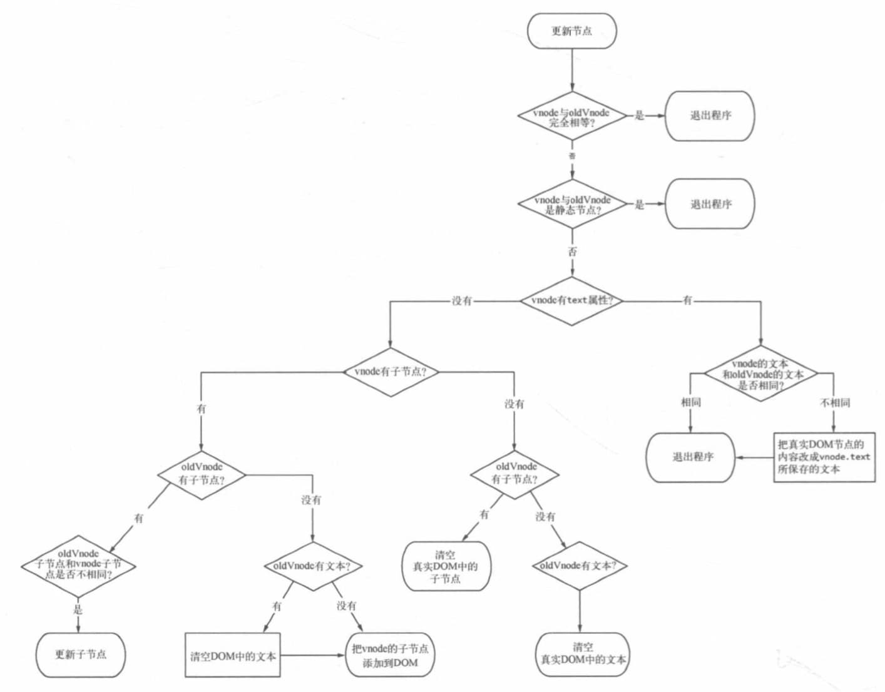

## 模版编译原理

模版编译的主要目的是生成渲染函数，具体包括三个部分

- 将模板编译为AST；对应解析器

解析器内部有很多小的解析器，其中包括过滤器解析器（解析过滤器），文本解析器（解析带变量的文本），HTML解析器，

- 遍历AST标记静态节点；对应优化器

遍历AST检测出所有的静态子树，并给打上标签，避免不必要的更新，用于提升性能。

- 使AST生成渲染函数；代码生成器

AST指的是js对象对节点的描述组成的树形结构。

## 用vnode描述一个DOM结构？

```
<div>
  <p>{{name}}</p>
</div>
```

使用js对象对其的描述

```
{
  tag: 'div',
  type: 1,
  attrsList: [],
  attrsMap: {},
  children: [
    {
      tag: 'p',
      type: 1,
      parent: {
        tag: 'div'
      },
      attrsList: [],
      attrsMap: {},
      children: [
        {
          type: 2,
          text: "{{name}}",
          static: false,
          expression: '_s(name)'
        }
      ]
    }
  ]
}
```

## vue.$set的作用及实现原理

vue只能侦测到初始化的data对象中的属性变更（添加）

```
data () {
  return {
    obj: '12445'
  }
}
在后续的代码中先是
this.data = {
  name: 'tom',
  age: 23
}
首次变化也是能监听到的，但是如果我们改变this.data.name = 'jack'，这个时候就不能监听到了
常见的解决方法使用vue.$set(this.data, name, 1234)
```
**分析源码：**

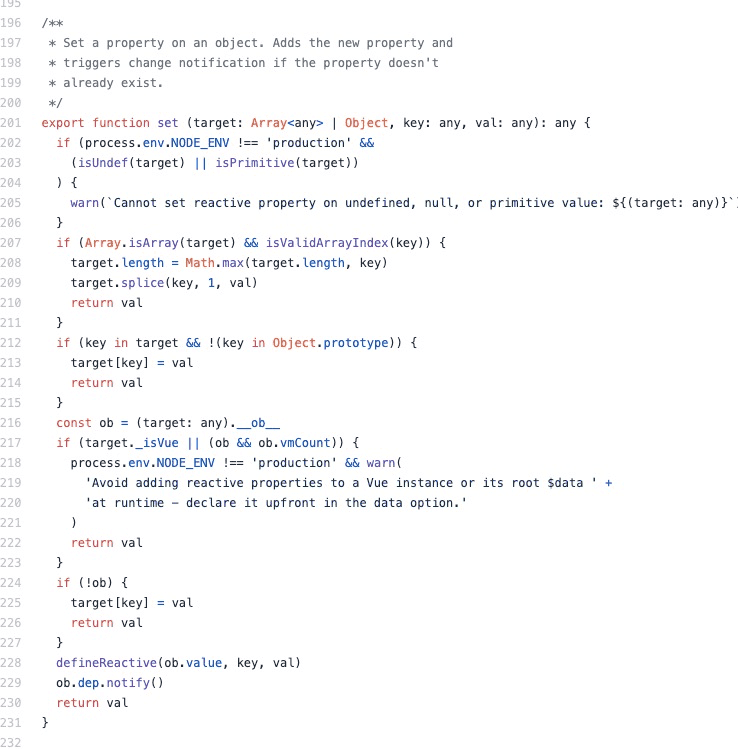

会发现**defineReactive(ob.value, key, val)**，就是将这个属性添加到这个对象的监听中，

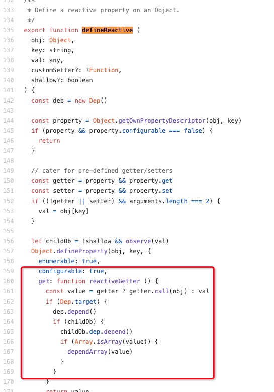

## 使用proxy简单实现Object.defineProperty的数据侦测？

```
var classInfo = {
  count: 4,
  student: {
    age: 20,
    name: 'tom'
  }
}

let observer = (data) => {
  if (!data || Object.prototype.toString.call(data) !== '[object Object]') {
    return;
  }
  Object.keys(data).forEach((itemKey) => {
    let currentValue = classInfo['itemKey'];
    if (typeof currentValue === 'object') {
      observer(currentValue);
      data[itemKey] = new Proxy(currentValue, {
        set(target, property, value, receiver) {
          return Reflect.set(target, property, value, receiver);
        };
      })
    } else {
      Object.defineproperty(data, itemKey, {
        get() {
          return currentValue;
        },
        set (newVal) {
          currentValue = value;
        }
      });
    }
  });
}
observer(classInfo);
```
**补充：**

- Proxy是对对象的一个代理，重塑了点运算符，基本套路是 
```
// target是目标对象，第二个参数是处理手段
var proxy = new Proxy(target, {
  .....
});
```
- Reflect是Object.defineProperty的替代，现阶段，某些方法同时在Object和Reflect对象上部署，
未来的新方法将只部署在Reflect对象上。也就是说，从Reflect对象上可以拿到语言内部的方法。
Reflect对象的方法与Proxy对象的方法一一对应，只要是Proxy对象的方法，就能在Reflect对象上找到对应的方法。

## 关于proxy相对Object.defineProperty的优势与缺点

在vue 实例化的时候，通过递归遍历整个对象使用Object.defineProperty对每个对象的属性进行劫持，但是有两种情况需要特殊处理：

- 属性是数组

解决方案：对于数组使用的是重写了Array的八种方法，每一次使用这几种方法时候会触发watcher

- 对象属性的动态添加

解决方案：使用$set，为对象添加属性，然后劫持这个属性

使用proxy就可以不用担心上面情况二的问题了，因为proxy可以对整个对象进行劫持，即使动态添加属性也能轻松感知到；

### 对于数组的操作仍然不能很好的解决

对于数组的问题，如果操作数组api在每次操作完数组之后能够改变原数组，那么也可以利用proxy进行处理，否则也会有问题。

```
let hobbits = ['travel', 'reading'];
let p = new Proxy(hobbits, {
  get(target, key) {
    // if(key === 'length') return true; //如果是数组长度的变化，返回。
    console.log('读取成功');
    return Reflect.get(target, key);
  },
  set(target, key, value) {
    // if(key === 'length') return true; //如果是数组长度的变化，返回。
    console.log('设置成功');
    return Reflect.set([target, key, value]);
  }
});
p.splice(0,1) //触发get和set，可以被劫持
p.push('photography');//触发get和set
p.slice(1); //触发get；因为 slice 是不会修改原数组的
```

### 对于对象嵌套对象的问题处理起来比较复杂

如果外层对象的一个属性是student(他也是个对象)，在使用proxy进行劫持的时候，会出现问题。
因为对象是一个引用类型的变量，属性名指向一个存储空间，所以当student的内部属性改变时，不会触发set, 而且会触发get，带来依赖收集的复杂性。

```
let obj = {name: 'Yvette', hobbits: ['travel', 'reading'], info: {
  age: 20,
  job: 'engineer'
}};
let p = new Proxy(obj, {
  get(target, key) { //第三个参数是 proxy， 一般不使用
    console.log('读取成功');
    return Reflect.get(target, key);
  },
  set(target, key, value) {
    console.log('设置成功');
    return Reflect.set([target, key, value]);
  }
});
p.name = 20; //设置成功
p.age = 20; //设置成功; 不需要事先定义此属性
p.hobbits.push('photography'); //读取成功;注意不会触发设置成功
p.info.age = 18; //读取成功;不会触发设置成功
```

## 描述组件渲染和更新的过程？

## vue父子组件生命周期调用顺序，minx与组件的生命周期顺序？

## 讲讲vue观察者模式和发布订阅者模式的具体实现


[vue.js技术揭秘](https://ustbhuangyi.github.io/vue-analysis/v2/extend/keep-alive.html#%E7%94%9F%E5%91%BD%E5%91%A8%E6%9C%9F)

[vue知识点](https://vue3js.cn/interview/vue3/proxy.html#%E4%B8%89%E3%80%81%E6%80%BB%E7%BB%93)