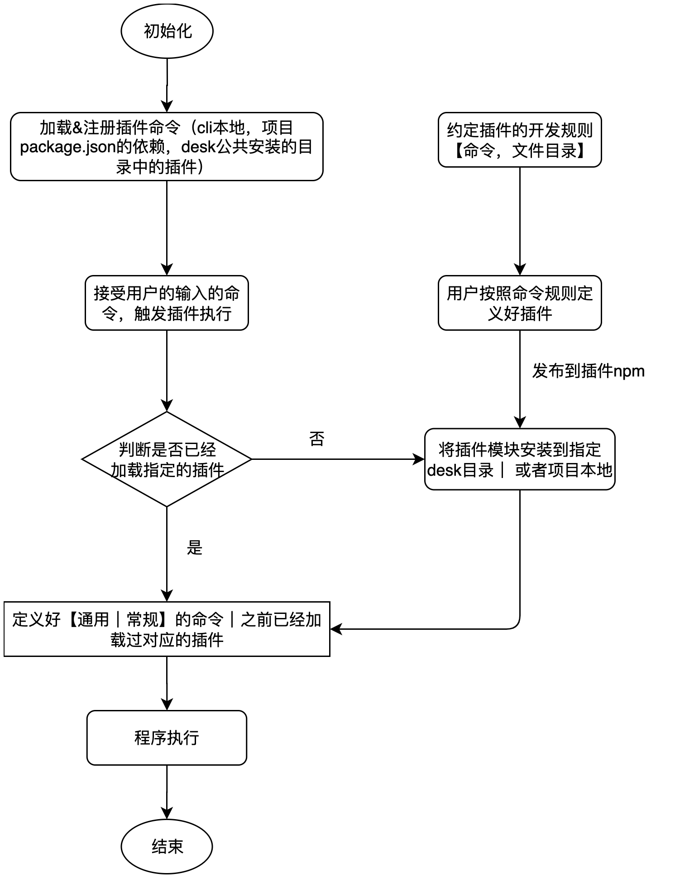

---
runme:
  id: 01HM6473M765R7XM5THWVEZ0ZC
  version: v2.2
---

## 在开发cli之前我们需要掌握一些必要的node模块

- chalk用于控制台提示信息输出

```js {"id":"01HM6473M6GNGMC8NCVZY0W84Q"}
const chalk = require('chalk');

function logError(obj={}) {
  const {msg, actionFun} = obj;
  console.log(chalk.red(msg));
  actionFun && actionFun();
}
```

- semver 用于版本号的比较处理

```ini {"id":"01HM6473M6GNGMC8NCW38Q2KVN"}
function checkNodeVersion() {
  const NodeVersion = process.versions.node;
  logNormal({msg: `当前node版本是： ${NodeVersion}`});
  const RequiredNodeRange = (packageJson?.engines?.node || '>=16.18.1'); 
  if (!semver.satisfies(NodeVersion, RequiredNodeRange)) {
    logEmptyLine();
    logWaring({msg: `当前node的版本太低，最低版本要求：${packageJson?.engines?.node || ">=16.18.1"}，请升级`});
  }
}
```

- commander 输入对应的关键字执行对应的指令

例如输入，npm start 之后会对代码进行构建，那么这个构建指令的触发，则需要commander

```ini {"id":"01HM6473M6GNGMC8NCW3BNQD79"}
// 新增页面
coreCommands.addPage = (programCommand) => {
  programCommand
  .alias("c")
  .description(`执行 ${cliPrefix} [a|addPage] "fileName" 创建一个页面`)
  .allowUnknownOption()
  .action(() => {
    const {addPage} = require('./core/add-page');
    addPage(programCommand);
  })
}
```

- inquirer 终端与用户进行交互，根据用户的输入，选择执行分支

```groovy {"id":"01HM6473M765R7XM5THN281K7Q"}
function addPage(programCommand) {
  curProgramCommand = programCommand;
  if (!programCommand.args[0]) {
    logError({msg: '请输入正确的文件名！'})
    return;
  }

  inquirer
  .prompt([
    {
      type: 'list',
      message: '选择需要生成的模版',
      name: 'choiceTemplate',
      choices: TemplateConfig
    }
  ])
  .then((answers) => {
    if (answers && answers?.choiceTemplate) {
      downloadPageTemplateFromGithub(answers?.choiceTemplate);
    }
  })
  .catch((error) => {
    console.log(error)
  });
}
```

- spawnSync｜exec 执行子进程

```js {"id":"01HM6473M765R7XM5THQYF31QN"}
function installPlugin(pluginName) {
  const cwd = process.cwd();
  spawnSync('npm',  ['install', `${pluginName}`, '--save'], {
    cwd,
    stdio: 'inherit'
  });
}
```

```js {"id":"01HM6473M765R7XM5THS9CCVT2"}
const evel_react_cli = {
  install: (args) => exec('npm', ['install', ...args]),
  uninstall: (args) => exec('npm', ['uninstall', ...args]),
  update: (args) => exec('npm', ['update', ...args]),
  run: (args) => exec('npm', ['run', ...args]),
}
```

## 如何实现开发者定义脚手架插件

> 一般思路都是在脚手架中定义好几个命令，让开发者直接使用，例如常见的是start, build, test等，如果需要拓展就让cli维护者重新开发，但是这种开发模式很难应对日益
> 复杂和频繁的需求

- 【解决方案】支持用户自定义插件机制



在上述的插件自定义开发流程很大程度上满足的业务需求个性化定制，不需频繁发布c容器的核心代码，cli容器主要做cli版本, node检测，插件的扫描，安装，注册等功能