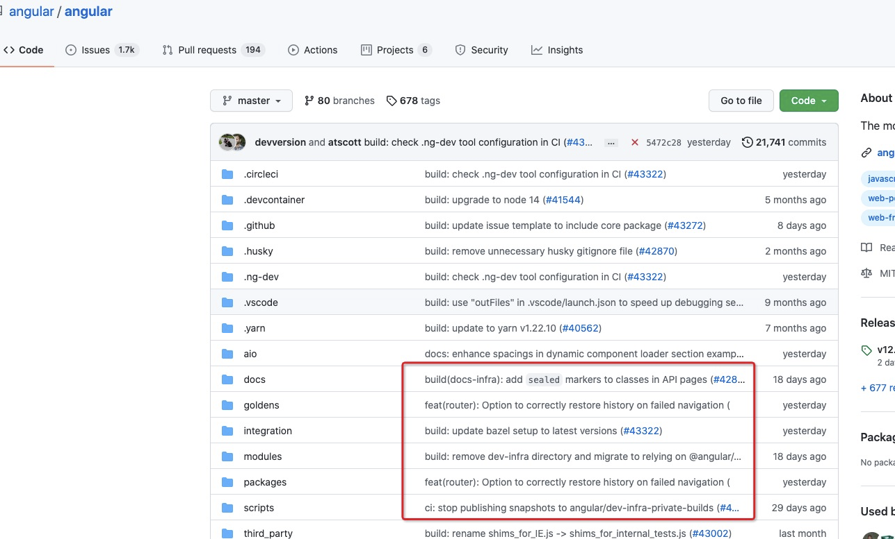
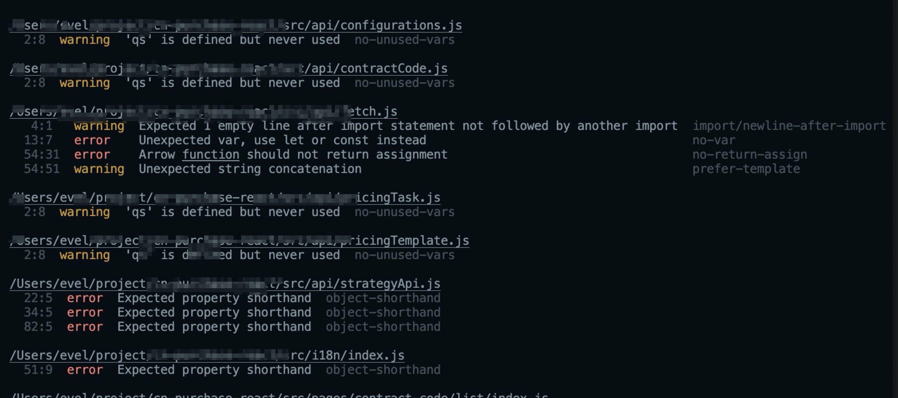
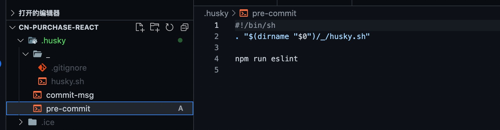
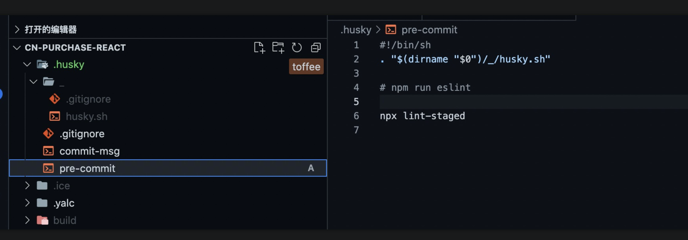

 # git提交规范制定&落地

 > 约定git提交信息规范，在出现问题的时候，能够利用提交信息迅速（定位｜过滤出）目标代码，加快问题修复速度。

 ## 规范格式简述：

一般的message格式包括header，body和footer，header中包括了type，scope和subject

```
<type>(<scope>): <subject>
 <BLANK LINE> <body> 
<BLANK LINE> <footer>
```
### header

**type一般就是描述提交的改动类型**

- feat：新增功能
- fix：修复bug
- docs：修改文档
- style：对代码的格式化进行改动，代码的逻辑没有发生变化
- test：新增或者修改测试用例
- refactor：重构代码，或者其他的优化举措
- chore：项目工程方面的改动，代码的逻辑并未发生任何变化
- evert：恢复之前的提交
- perf：提升页面性能
- deps：升级依赖

**scope一般是用来描述本次提交涉及到的改动范围，具体取值根据项目定**

**subject就是用来概括和描述本次提交的改动内容**

> git commit -m <type>[optional scope]: <subject>

比如新增了一个按钮可以在提交时写 

> git commit -m "feat:add a button"

> git commit -m "feat:添加一个按钮"

如果修复了一个bug可以是 

> git commit -m "fix:modify a bug"

> git commit -m "fix:修改了一个xxbug"

### body

主要是用来描述详细的提交内容，可写可不写

### footer

用于代码评审过程记录作者签名等等，可写可不写

ie: angular提交规范



## 规范约束

需要自己在项目中配置

> commitlint：定义提交信息规则

> husky：git 钩子函数使用

### 配置：commitlint，husky

参考文档：https://commitlint.js.org/#/guides-local-setup

1. 安装commitlint

```
npm install --save-dev @commitlint/{cli,config-conventional}
```

2. 生成commitlint.config文件

```
echo "module.exports = { extends: ['@commitlint/config-conventional'] };" > commitlint.config.js
```

3. 安装husky

```
tnpm install husky --save-dev

npx husky install
```

4. 配置commitlint.config.js

```
module.exports = { extends: ['@commitlint/config-conventional'],
  rules: {
    'type-enum': [2, 'always', [
      'feat', // 新功能
      'update', // 更新
      'fix', // 修复bug
      'refactor', // 重构
      'perf', // 优化
      'style', // 样式
      'docs', //  文档更新
      'test', // 测试 
      'deps', // 依赖升级
      'chore' // 构建过程或者辅助工具的变动
    ]],
    'header-case': [2, 'always', 'lower-case'],
    'scope-case': [2, 'always', 'lower-case'],
    'type-case': [2, 'always', 'lower-case'],
    'type-empty': [2, 'never'],
    'subject-empty': [2, 'never'],
    'subject-case': [2, 'always', 'lower-case'],
    'header-max-length': [2, 'always', 40]
  }
};
```

### commit之前校验代码规范

- 添加一个commit-msg钩子函数

```
npx husky add .husky/commit-msg 'npx --no-install commitlint --edit $1'
```

- 添加pre-commit钩子函数

```
npx husky add .husky/pre-commit "npm run lint"
```
会发现钩子函数多了一个



提交代码（提交之后eslint提醒报错） git commit -a -m "feat: ***"



### [git的钩子函数](<https://git-scm.com/book/zh/v2/%E8%87%AA%E5%AE%9A%E4%B9%89-Git-Git-%E9%92%A9%E5%AD%90>)

问题一：上面的配置是全局的，对于老项目如果之前代码没有开启，eslint 现在提交，会导致eslint提醒报错？？？？能否做到只争对当前修改的文件进行eslint校验？？

lint-staged 只对修改暂存的文件进行eslint校验；另外如果安装了“Prettier-Code formatter"插件，保存之后会自动修正代码格式（如果配置了eslint规则）

- lint-staged 使用方式：

> npx mrm@2 lint-staged

1. pre-commit钩子配置修改



2. package.json修改

```
"lint-staged": {
  "*.{js,jsx}": ["eslint --cache --fix"],
  "*.css": "stylelint --fix"
}
```
env：expected node@>=12