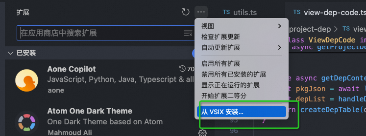
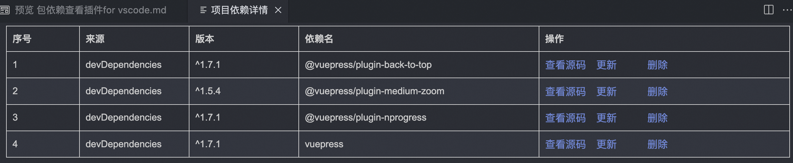

# 包依赖插件for vscode

前端开发中遇到问题经常会遇到，查看第三方依赖包源码的情况，一般都是打开node_modules目录，然后通过文件搜索的方式来查找。
这种方式比较笨拙，而且不方便，所以我写了一个vscode插件，可以直接在vscode中查看依赖包的源码。

## 安装

打开vscode插件市场，搜索 "vscode-plugin-utils", 一键安装

## 使用

安装成功之后，选中项目的package.json文件，然后鼠标右键，选择"项目依赖" 即可



## 开发

使用命令行生成一个模板

```
// 安装需要的包
npm install -g yo generator-code
// 运行
yo code
```

编辑package.json文件 ， 主要是contributes的配置

```
  "contributes": {
    "commands": [
      {
        "command": "view-project-dep-source-code",
        "title": "项目依赖"
      }
    ],
    "menus": {
      "explorer/context": [
        {
          "when": "resourceFilename==package.json", // 选中package.json文件时候，执行view-project-dep-source-code命令
          "command": "view-project-dep-source-code",
          "group": "project-dep"
        }
      ]
    }
  },
```

代码仓库：https://github.com/EvalGitHub/vscode-plugins-utils.git

## 发布

**本地安装**

先安装vsce

```
npm install -g @vscode/vsce
```

本地打包

```
vsce package
```
线下安装



**发布到插件市场**

发布之前可以修改readme.md文件，补充下更新内容，注意修改版本号
```
vsce publish
```

## 参考
- [vscode插件开发文档](https://code.visualstudio.com/api/get-started/your-first-extension)
- [vscode插件发布文档](https://code.visualstudio.com/api/working-with-extensions/publishing-extension)
- [vscode插件市场文档](https://code.visualstudio.com/api/working-with-extensions/publishing-extension#get-a-personal-access-token)
- [vscode插件管理市场](https://marketplace.visualstudio.com/publishers/evel-vscode-plugins)