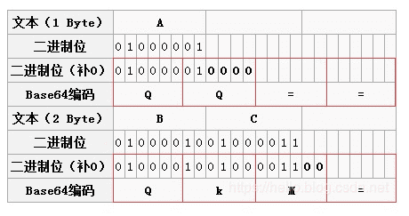

# base64的实现原理

## 为什么需要base64

计算机中的字节共有256个组合，对应就是ascii码，而ascii码的128～255之间的值是不可见字符。而在网络上交换数据时，比如说从A地传到B地，往往要经过多个路由设备，由于不同的设备对字符的处理方式有一些不同，这样那些不可见字符就有可能被处理错误，这是不利于传输的。所以就先把数据先做一个Base64编码，统统变成可见字符，这样出错的可能性就大降低了

## base64的使用场景

网页url，cookie/token，以及文件上传，base64的格式图片

## 原理

>Base64编码本质上是一种**将二进制数据转成文本数据**的方案。对于非二进制数据，是先将其转换成二进制形式，然后每连续6比特（2的6次方=64）计算其十进制值，根据该值在上面的索引表中找到对应的字符，最终得到一个文本字符串

1. 先将待转化的目标字符串按照每三个字节为一组转化为二进制，不够八位的前面补零，会得到每组24个进制位

2. 将上面的24个进制位分为4组（即四个字节），每组6个bit（每组前置补2个0）

3. 将上面的四个字节（二进制串转换为10进制），按照base64编码对照表获取对应值

base64的编码对照表组成元素是A-Z(0-25), a-z(26-51), 0-9(52-61) '+', '/' 共64个元素

**示例视图：**



## 简单实现一个base64的编码函数

- 实现base64的对照表

```
let matchBaseObj = {
  0:　'A',　　17:　'R',　　　34:　'i',　　　51:　'z',
  1:　'B',　　18:　'S',　　　35:　'j',　　　52:　0,
  2:　'C',　　19:　'T',　　　36:　'k',　　　53:　1,
  3:　'D',　　20:　'U',　　　37:　'l',　　　54:　2,
  4:　'E',　　21:　'V',　　　38:　'm',　　　55:　3,
  5:　'F',　　22:　'W',　　　39:　'n',　　　56:　4,
  6:　'G',　　23:　'X',　　　40:　'o',　　　57:　5,
  7:　'H',　　24:　'Y',　　　41:　'p',　　　58:　6,
  8:　'I',　　25:　'Z',　　　42:　'q',　　　59:　7,
  9:　'J',　　26:　'a',　　　43:　'r',　　　60:　8,
  10:　'K',　　27:　'b',　　　44:　's',　　　61:　9,
  11:　'L',　　28:　'c',　　　45:　't',　　　62:　'+',
  12:　'M',　　29:　'd',　　　46:　'u',　　　63:　'/',
  13:　'N',　　30:　'e',　　　47:　'v',
  14:　'O',　　31:　'f',　　　48:　'w',　　　
  15:　'P',　　32:　'g',　　　49:　'x',
  16:　'Q',　　33:　'h',　　　50:　'y',
};
```

- 将字符串转化为二进制（补全八位）

1111 -> 00001111

```
// 返回二进制str补全八位，返回目标字符串的二进制字符串
function getTranslateVal(num, ascii=2) {
  let _tmpRes = parseInt(num).toString(ascii);
  if (_tmpRes.length === 8) {
    return _tmpRes;
  }
  let _fixStr = '00000000';
  return _fixStr.slice(_tmpRes.length) + _tmpRes;
}
```

- 将二进制字符串%6取余，末尾补0

111 -> 111000

```
// 二进制字符串补位6位（不够就在后面补0）
function subStrToSixLen(codeStr, len=6) {
  if (!codeStr) {
    return;
  }
  let plusLen = codeStr.length % len;
  if (plusLen > 0) { // 等于0说明刚好是六位的倍数
    let fixStr = '000000';
    codeStr += fixStr.slice(plusLen);
  }
  return codeStr;
}
```

- 将补全的二进制字符串（当前length是6的整数倍），不够24位，按照每6位补充“=”

```
function getTranslateToBase64Str(str) {
  if (!str) {
    return;
  }
  let strPlus = str.length % 24; 
  let _res = ''; 
  let strMatchObj = '';
  let strLenght = str.length;
  if (strPlus > 0) { // 如果等于0；4*6 =24说明刚好够分四组的倍数
    strMatchObj = {
      '6': '===',
      '12': '==',
      '18': '='
    }
  } 
  for(let i = 0; i < parseInt(strLenght / 6); i++) {
    _res += matchBaseObj[parseInt(str.substr(i*6, 6), 2).toString(10)];
  }
  return strPlus > 0 ? _res + strMatchObj[strPlus] : _res;
}
```

- 入口函数

遍历目标字符串获取，获取目标字符串的ASCII码串

然后将ASCII码串转化为二进制串

```
function strChangeToBase64Str(str) {
  let strLength = str.length; 
  if (!str) {
    return;
  }
  let codeStr = '';
  for (let i =0; i< str.length; i++) {
    codeStr += getTranslateVal(str[i].charCodeAt()); 
    // 获得目标字符串的ASCII码 -> 二进制串
  }
  let strSixLen = subStrToSixLen(codeStr);
  console.log('最终结果是:', getTranslateToBase64Str(codeStr));
  return getTranslateToBase64Str(codeStr);
}
```

## 补充说明

- Base64字符表中的字符原本用6个bit就可以表示，现在前面添加2个0，变为8个bit，会造成一定的浪费。因此，Base64编码之后的文本，要比原文大约三分之一  (32-24)/24。

- 为什么使用3个字节一组呢？因为6和8的最小公倍数为24，三个字节正好24个二进制位，每6个bit位一组，恰好能够分为4组。


**参考：**
[一篇文章彻底弄懂Base64编码原理](https://blog.csdn.net/wo541075754/article/details/81734770?utm_medium=distribute.pc_relevant.none-task-blog-BlogCommendFromMachineLearnPai2-1.nonecase&depth_1-utm_source=distribute.pc_relevant.none-task-blog-BlogCommendFromMachineLearnPai2-1.nonecase)

[为什么要使用base64编码，有哪些情景需求?](https://www.zhihu.com/question/36306744)