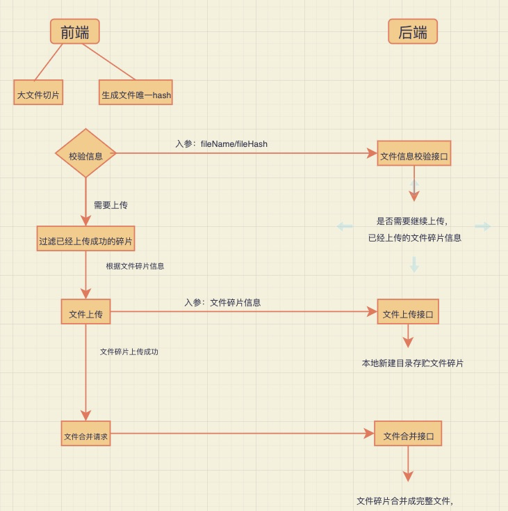

# 前端实现大文件上传

## 背景 
如果前端要实现超大文件（几个G）上传怎么办? 对于浏览器而言普通文件上传只是通过一个
链接进行数据传输，如果文件太大，可想而知比较耗时且容易失败失败了还的重新上传。

## 技术方案

如果能够将文件进行切割成些许小碎片, 例如将1G的文件切割成11份，按照一定顺序进行排序，
然后利用浏览器一次能够同时并发4-8个请求的方式，将这11份小文件碎片进行请求发送到后端，
上传完之后在将文件碎片进行重组成一个完整的文件，上传速度能够提升4-8倍；




### 文件如何进行切分

文件对象是Blob类型，使用slice进行切割

```
// 生成文件切片
createFileChunk(file, size=SIZE) {
    const fileChunkList = [];
    let cur = 0;
    while(cur < file.size) {
        fileChunkList.push({file: file.slice(cur, cur+size)});
        cur += size;
    }
    return fileChunkList;
},
```

然后只需要将这些碎片并行发送请求，待请求发送完成之后，在发送合并请求，通知服务进行文件合并。

### 如何做断点续传

上面已经完成了对文件的切割, 那么如何对文件片做唯一标示呢？
我们需要根据文件内容生成唯一hash, 然后使用hash+index作为每一个文件碎片的标示，
这样做的一个好处就是能把每个文件区分开，如果由于网络原因导致某些文件件碎片上传失败
支需要去过滤调上传成功的碎片，然后上传没上传成功的碎片。

```
// 上传切片
async uploadChunks(uploadedList = []) {
    const requestList = this.fileData.filter(({ hash }) => !uploadedList.includes(hash))
        .map(({chunk, hash, index}) => {
        const formData = new FormData;
            formData.append("chunk", chunk);
            formData.append("hash", hash);
            formData.append("filename", this.container.file.name);
            formData.append("fileHash", this.container.hash);
            return {formData, index};
    }).map(async({formData, index}) => xhrFun({  
            url: "http://localhost:3000",
            data: formData, 
            onProgress: this.createProgressHandler(this.fileData[index]),
            requestList: this.requestList
        }));
    await Promise.all(requestList); // 并发切片
    await this.mergeRequest();
},
```

### 文件被切碎之后怎么合并成完整的文件

由于使用了hash和index作为文件的标示，因此可以在文件碎片上传完之后，直接发送请求通知服务端去完成文件合并的动作（只需要根据文件碎片名index去按顺序合并）

```
// 合并切片
const mergeFileChunk = async (filePath, fileHash, size) => {
  const chunkDir = path.resolve(UPLOAD_DIR, fileHash);
  const chunkPaths = await fse.readdir(chunkDir);
  // 根据切片下标进行排序
  // 否则直接读取目录的获得的顺序可能会错乱
  chunkPaths.sort((a, b) => a.split("-")[1] - b.split("-")[1]);
  await Promise.all(
    chunkPaths.map((chunkPath, index) =>
      pipeStream(
        path.resolve(chunkDir, chunkPath),
        // 指定位置创建可写流
        fse.createWriteStream(filePath, {
          start: index * size,
          end: (index + 1) * size
        })
      )
    )
  );
  fse.rmdirSync(chunkDir); // 合并后删除保存切片的目录
};
```

以上具体实现源码可以参考

[前端代码](https://github.com/EvalGitHub/vue-study/blob/master/src/views/upload_file/index.vue)， [node服务](https://github.com/EvalGitHub/vue-study/blob/master/server/index.js) 

## 阿里云方案

对于这种常见的大文件上传需求，阿里云提供了比较好的[解决方案](https://help.aliyun.com/document_detail/64047.htm?spm=a2c4g.11186623.2.16.5a9423f2whOqN0#section-snl-fxt-4fb)。

通过这种方式只需要申请几个oss参数，简单封装即可。
