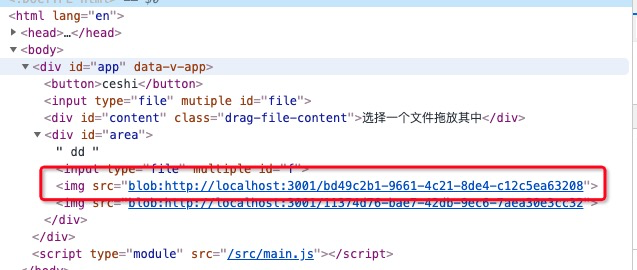

# 每天一个浏览器的API

## window.getSelection

> 返回一个section对象，表示用户选择的文本范围或光标的当前位置

```
var selection = window.getSelection();
var selContent = selection.getRangeAt(0);
var range1= selContent.getRangeAt(0);
console.log(range1.startContainer);
```

[关于window.getSelection](https://blog.csdn.net/weixin_42420703/article/details/84892528)

## Text.splitText()

> splitText() 方法按照指定的 offset 把文本节点分割为两个节点

## event.target.closet

> 遍历元素和他的父级别元素，至到返回目的元素

```
<article>
  <div id="div-01">Here is div-01
    <div id="div-02">Here is div-02
      <div id="div-03">Here is div-03</div>
    </div>
  </div>
</article>

var el = document.getElementById('div-03');

var r1 = el.closest("#div-02");
// returns the element with the id=div-02

var r2 = el.closest("div div");
// returns the closest ancestor which is a div in div, here it is the div-03 itself

var r3 = el.closest("article > div");
// returns the closest ancestor which is a div and has a parent article, here it is the div-01

var r4 = el.closest(":not(div)");
```

## Window.speechSynthesis | SpeechSynthesisUtterance

> 语音api

```
// speechSynthesis.getVoices() 可以获取浏览器支持的语音
var u = new SpeechSynthesisUtterance();
u.text = "文字播放";
u.lang = 'zh-HK'; // ja-JP 
u.rate = 8
speechSynthesis.speak(u);
```
https://github.com/mdn/web-speech-api/


## Blob

> 表示一个不可变，原始数据的类文件对象；它的数据可以按文本或二进制的格式进行读取，也可以转换成 ReadableStream 来用于数据操作。 
### Blob构造函数 

```
new Blob(blobParts, options)
```

- blobParts

可以是任意多个_ArrayBuffer, ArrayBufferView, Blob或者DOMString

- options

可选项，用于设置blob对象的属性

### 属性

- Blob.size: blob对象中包含的数据大小
- Blob.type: 表明该Blob对象所含数据的类型

### Blob数据的读取

- 使用FileReader

```
readBlobContent() {
  const blob = new Blob(['<xml>fo</xml>'], {type: 'text/xml'});
  const reader = new FileReader();
  reader.readAsText(blob); // <xml>foo</xml>
  //reader.readAsArrayBuffer(blob); // ArrayBuffer(14) {}
  // reader.readAsDataURL(blob);
}
```

- 使用Response对象将Blob中的内容读取为文本

```
let text = await (new Response(blob)).text();
```

### BlobURL

> 是一种伪协议， 只能有浏览器在内部生成；可以把blob和file转化成url生成BlobURL来展示图像，下载二进制数据链接的URL

#### 展示一张图片

 - demo: 直接将将一张图片展示在页面上

```
  <div id="area">
      <input type="file" multiple id="f" @change="createBlobUrl"/>
  </div>

  // create blobURL
  getObjectUrl(file) {
    let url = null;
    if (window.createObjectURL) {
        url = window.createObjectURL(file);
    } else if (window.URL) {
      url = window.URL.createObjectURL(file);
    } else if (window.webkitURL) {
      url = window.webkitURL.createObjectURL(file);
    }
    return url;
  },
  createBlobUrl(event) {
    const ele = document.getElementById('f');
    const content = document.getElementById('area');
    const files = event.target.files;
    const file = files[0];
    const img = document.createElement('img');
    img.src = this.getObjectUrl(file);
    content.appendChild(img);
  }
```

操作之后可以发现这个链接不是一个普通的img链接, 这种方式类似于base64的形式



**如果使用dataURL的形式如何展示呢？**

```
createDataUrl(event) {
  const ele = document.getElementById('f');
  const content = document.getElementById('area');
  const files = event.target.files;
  const file = files[0];
  const img = document.createElement('img');
  const reader = new FileReader();
  reader.onload = () => {
    img.src = reader.result;
  };
  reader.readAsDataURL(file);
  content.appendChild(img);
}
```
#### 下载一个文件

- blobURL
```
downloadFun() {
  const fileName = 'download.txt';
  const blob = new Blob(['test data'], { type: 'text/plain' });
  const link = document.createElement('a');
  link.href = this.getObjectUrl(blob);
  link.download = fileName;
  link.click();
  link.remove();
  URL.revokeObjectURL(link.href);
}
```
- dataURL

```
downloadFun() {
  const fileName = 'download.txt';
  const blob = new Blob(['test data'], { type: 'text/plain' });
  const reader = new FileReader();
  const link = document.createElement('a');
  link.download = fileName;
  reader.onload = () => {
    link.href = reader.result;
    link.click();
  };
  reader.readAsDataURL(blob);
}
```
### dataURL

> 将较小的文件嵌入到文档中, 语法格式，data:mediatype[;base64],data

**获取dataUrl**

  - FileReader的readAsDataURL
  - 原生的编码方法btoa, 解码atob
  - canvas的toDateURL

#### dataURL & blobURL的区别

- BlobUrl较短，它并不代表数据本身，数据存储在浏览器中，BlobUrl只是访问它的key; 但DataUrl因为直接存储图片base64编码后的数据

## DeviceOrientation与devicemotion

