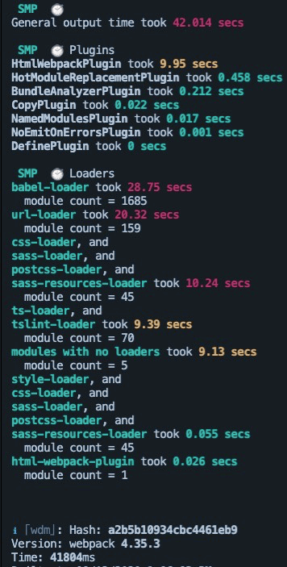
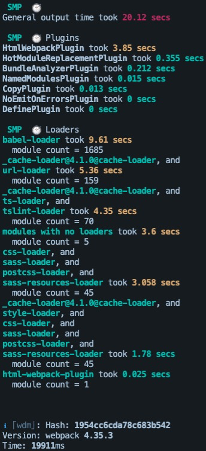
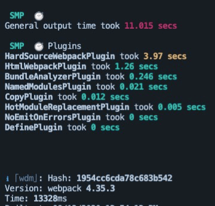

# 提升webpack打包速度

## speed-measure-webpack-plugin

查看每个plugin，loader的工作时间，对应做优化



可见babel-loader，url-loader，ts-loader的耗时比较长，所以每次构建时会花非很多时间。

- 解决方案：使用**cache-lodader**提升二次构建速度提升

cache-loader的使用比较简单，只需要在每个loader前面添加
cache-loader即可

babel-loader有自己的缓存配制项
```
cacheDirectory: true,
```

优化后的结果：打包时间从41804ms -> 19911ms



## cache-loader提升二次打包速度

 loader 的编译结果写入硬盘缓存，再次构建如果文件没有发生变化则会直接拉取缓存。

> 每一次项目变更的时候，没有必要将所有文件都重编译一遍，所以我们可像浏览器加载资源样，将没有改变的内容缓存下来。大部分loader都提供了cache配置项，比如在 babel-loader 中，可以通过设置 cacheDirectory 来开启缓存，这样，babel-loader 就会将每次的编译结果写进硬盘文件（默认是在项目根目录下的node_modules/.cache/babel-loader目录内，当然你也可以自定义）。

但是也有些没有缓存配置项的，这个时候我们可以合理使用cache-loader（值得注意的是：要把它写在所有loader的最前面）

**请注意，保存和读取这些缓存文件会有一些时间开销，所以请只对性能开销较大的 loader 使用此 loader**

```
module.exports = {
  module: {
    rules: [
      {
        test: /\.js$/,
        use: [
          'cache-loader',
          'babel-loader'
        ],
        include: path.resolve('src')
      }
    ]
  }
}
```

[关于cache-loader的使用](https://www.webpackjs.com/loaders/cache-loader/)

## 使用HardSourceWebpackPlugin提升二次构建速度

各个模块的缓存，默认只缓存50M，可以自定义配制缓存的大小

```
const HardSourceWebpackPlugin = require('hard-source-webpack-plugin');
....
....
plugins: [
  new HardSourceWebpackPlugin(),
  ...
  ...
]
```
使用之后的截图




## webpack.dll.plugin避免重复打包

在执行webpack打包的时候，每一次都会去重新分析项目中所有的依赖包，这是一个比较费时的工作，考虑到有些第三方包我们更 本不会去修改，因此可以想办法将这些包只打包一次。

> webpack.DllPlugin：将第三方包单独打包到某个文件，然后只需直接引入即可

**首先你需要创建一个webpack.dll.config.js**

```
// 对于长久不变的第三方库，使用dll打包，优化打包速度
const path = require('path');
const webpack = require('webpack');

module.exports = {
  mode: 'production',
  entry: {
    // 定义程序中打包公共文件的入口文件thirdlibrary.js
    'thirdlibrary': ['react', 'react-router', 'react-dom', 'react-router-dom']
  },

  output: {
    path: path.resolve(__dirname, '..', 'dll'),
    filename: '[name].dll.js',
    library: '[name]_[hash]', // 暴露这个库全局可用,
    libraryTarget: 'this'
  },

  plugins: [
    new webpack.DllPlugin({
      context: process.cwd(),
      // 分析库文件的映射关系（可以为webpack避免直接使用node_module中的库提供依据）
      path: path.resolve(__dirname, '..', 'dll/[name]-manifest.json'),
      name: '[name]_[hash]' // 与output的library同名
    })
  ]
}

```

引入的时候需要使用 **add-asset-html-webpack-plugin**

**配置webpack.common.js**

```
const AddAssetHtmlPlugin = require('add-asset-html-webpack-plugin');

plugins: [
	// 将打包好的第三方插件加到html，静态资源上
	new AddAssetHtmlPlugin(
      // 对应的 dll 文件路径
      { 
        filepath: path.resolve(__dirname, '../dll/thirdlibrary.dll.js'),
        includeSourcemap: false,
        hash: true
      },
    ),
    // 使用生成的thirdlibrary-manifest.json来分析包的引用情况，避免重复打包，会在全局变量中直接引用
    new webpack.DllReferencePlugin(
      {
        manifest: path.resolve(__dirname, '..', 'dll/thirdlibrary-manifest.json')
      }
    )
]
```

**存在的问题：** 如果我们将所有的第三方包都放在一个thirdlibrary.dll.js中，就会使得这个文件变得很大，这样下载的速度就很慢，如果我们能按分开打包为多个文件，这样在首次加载的时候可以并行下载，提升速度。

**修改webpack.dll.config.js**

```
module.exports = {
  mode: 'production',
  entry: {
    // 定义程序中打包公共文件的入口文件vendor.js
    'react': ['react', 'react-dom'],
    'react-router': ['react-router', 'react-router-dom']
  },
  .....
```

重新执行npm run build:dll 【  "build:dll": "webpack --config webpack/webpack.dll.config.js"】

**修改webpack.common.config.js**

将plugins抽离出去，变成动态生成的

```
// 基础plugins
const plugins = [
  new WebpackBuildNotifierPlugin({
    title: "My Project Webpack Build",
    // logo: path.resolve("./img/favicon.png"),
    suppressSuccess: true
  }),
  new HtmlWebpackPlugin({
    template: '../index.html'
  }),
  new MiniCssExtractPlugin({
    filename: '[name].css',
    chunkFilename: '[name].[chunkhash:8].css',
  }),
];
/* 动态生成plugin [根据dll文件下的文件个数动态添加AddAssetHtmlPlugin， **webpack.DllReferencePlugin]
*/
const files = fs.readdirSync(path.resolve(__dirname, '../dll'));
files.forEach(file => {
  if (/.*\.dll.js/.test(file)) {
    plugins.push(
      new AddAssetHtmlPlugin(
        { 
          filepath: path.resolve(__dirname, '../dll', file),
          includeSourcemap: false,
          hash: true
        },
      )
    )
  };
  if (/.*\.manifest.json/.test(file)) {
    plugins.push(
      new webpack.DllReferencePlugin(
        { 
          manifest: path.resolve(__dirname, '../dll', file)
        },
      )
    )
  }
});
```

## HappyPack/thread-loader多线程提升打包速度

由于运行在 Node.js 之上的 Webpack 是单线程模型的，所以Webpack 需要处理的事情需要一件一件的做，不能多件事一起做。
 我们需要Webpack 能同一时间处理多个任务，发挥多核 CPU 电脑的威力，[HappyPack](https://link.jianshu.com?t=https%3A%2F%2Fgithub.com%2Famireh%2Fhappypack) 就能让 Webpack 做到这点，它把任务分解给多个子进程去并发的执行，子进程处理完后再把结果发送给主进程

```
const HappyPack = require ('happypack')
const os = require('os')
// 获取系统cpu的最大核数
const happyThreadPool = HappyPack.ThreadPool({ size: os.cpus().length });
module.export = {
    module: {
        rules: [
            {
                test: /\.(js|jsx)$/,
                exclude: /(node_modules|bower_components)/,
                use: 'happypack/loader?id=js',
            }
        ]
    },
    plugins: [
        new HappyPack({
      		id: 'js',
			threadPool: happyThreadPool,
     		loaders: [{
          		loader: 'babel-loader',
        	}],
        }),
    ]
}
```

所以配置起来逻辑其实很简单，就是用 happypack 提供的 Plugin 为你的 Loaders 做一层包装就好了，向外暴露一个id ，而在你的 module.rules 里，就不需要写loader了，直接引用这个 id 即可。

**note: 如果项目不是很大，不到万不得已不建议使用这种多线程手段，因为多线程本生就是比较耗时的，所以对于小型项目不建议使用。**

[happyWebpack的使用](https://mp.weixin.qq.com/s/WmTWXoYn_CvD60nd0_biuQ)

## 使用noParse，IgnorePlugin

webpack在打包的时候会将每个js文件进行解析，这是十分耗时的；如果你能确定有些库文件
不会依赖其他的库（不会使用import，require等形式引入其他文件），这个时候可以使用
noParse告诉webpack去避免解析这类的文件（库），常见的有jquery，loash。

```
  noParse: '/jquery|lodash/'
```
<https://webpack.js.org/configuration/module/#modulenoparse>

## 使用module IDs 