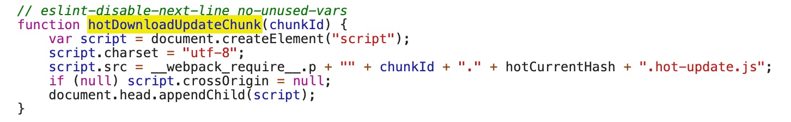
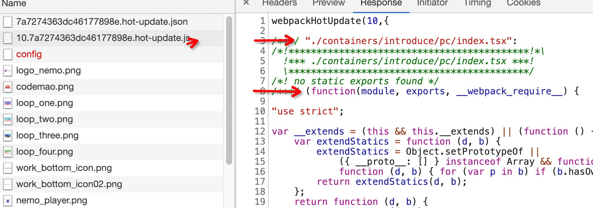
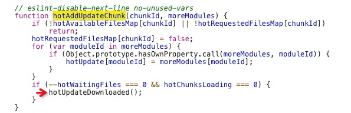

# webpack热更新的原理

webpack开发环境可以是实现页面无刷新的更新，能简单说说其执行步骤吗？

翻看webpack-dev-server的源码，一探究竟。

## webpack-dev-server

1. 先建立一个服务
```
createServer() {
  if (this.options.https) {
    const isHttp2 = this.options.http2 !== false;
    if (semver.gte(process.version, '10.0.0') || !isHttp2) {
      ....
      ....
      this.listeningApp = https.createServer(this.options.https, this.app);
    } else {
      this.listeningApp = require('spdy').createServer(
        this.options.https,
        this.app
      );
    }
  } else {
    this.listeningApp = http.createServer(this.app);
  }
}
```

创建一个socket链接
```
listen(port, hostname, fn) {
  this.hostname = hostname;
  return this.listeningApp.listen(port, hostname, (err) => {
    this.createSocketServer();
    ....
    ....
  });
}
```

2. 监听webpack的编译的编译结束

```
setupHooks() {
  ....
  ....
  const addHooks = (compiler) => {
    const { compile, invalid, done } = compiler.hooks;
    compile.tap('webpack-dev-server', invalidPlugin);
    invalid.tap('webpack-dev-server', invalidPlugin);
    done.tap('webpack-dev-server', (stats) => { //  编译完成，发送一个socket信息
      this._sendStats(this.sockets, this.getStats(stats));
      this._stats = stats;
    });
  };
  ....
  ....
}
```

**_sendStats 函数**

```
_sendStats(sockets, stats, force) {
  .....
  .....
  this.sockWrite(sockets, 'hash', stats.hash);
  if (stats.errors.length > 0) {
    this.sockWrite(sockets, 'errors', stats.errors);
  } else if (stats.warnings.length > 0) {
    this.sockWrite(sockets, 'warnings', stats.warnings);
  } else {
    this.sockWrite(sockets, 'ok');
  }
}
```

3. 监听文件变化(webpack-dev-middleware)

每一次文件改变保存都会重新的编译

setupDevMiddleware函数
```
setupDevMiddleware() {
  // middleware for serving webpack bundle
  this.middleware = webpackDevMiddleware(
    this.compiler,
    Object.assign({}, this.options, { logLevel: this.log.options.level })
  );
}
```

webpackDevMiddleware的核心代码片段

```
....
....
if (!options.lazy) {
  context.watching = compiler.watch(options.watchOptions, (err) => {
    // 监听webpack的编译
    if (err) {
      context.log.error(err.stack || err);
      if (err.details) {
        context.log.error(err.details);
      }
    }
  });
} else {
  context.state = true;
}

if (options.writeToDisk) {
  toDisk(context);
}
// 将文件写入内存
setFs(context, compiler);
```
为什么代码的改动保存会自动编译，重新打包？这一系列的重新检测编译就归功于compiler.watch这个方法。

执行setFs方法，这个方法主要目的就是将编译后的文件打包到内存。这就是为什么在开发的过程中，你会发现dist目录没有打包后的代码，因为都在内存中。原因就在于访问内存中的代码比访问文件系统中的文件更快，而且也减少了代码写入文件的开销，这一切都归功于memory-fs。

3. 浏览器接收到热更新的通知

当监听到一次webpack编译结束（步骤二），_sendStats方法就通过websoket给浏览器发送通知，检查下是否需要热更新

webpack-dev-server/client/index.js这个文件就是执行在浏览器的代码，当步骤二中监听到文件已经打包完成
就会发送一个socket信息，如果编译通过会执行发送以下两个方法
```
this.sockWrite(sockets, 'hash', stats.hash);
this.sockWrite(sockets, 'ok');
```

在客户端client中会进行处理，执行reloadApp
```
ok: function ok() {
  sendMessage('Ok');
  ....
  if (options.useWarningOverlay || options.useErrorOverlay) {
    overlay.clear();
  }
  ....
  reloadApp(options, status);
},
```
**reloadApp.js**

发送‘webpackHotUpdate’信息
```
if (hot) {
  log.info('[WDS] App hot update...'); // eslint-disable-next-line global-require

  var hotEmitter = require('webpack/hot/emitter');

  hotEmitter.emit('webpackHotUpdate', currentHash);

  if (typeof self !== 'undefined' && self.window) {
    // broadcast update to window
    self.postMessage("webpackHotUpdate".concat(currentHash), '*');
  }
} 
```

socket的客户端代码的发出“webpackHotUpdate”信息，通知webpack进行热更新

// webpack/hot/dev-server.js
```
var check = function check() {
  module.hot
    .check(true)
    .then(function(updatedModules) {
      if (!updatedModules) {
        ....
        window.location.reload();
        return;
      }
      ......
      if (!upToDate()) {
        check();
      }
    })
  ....
  .....
};

hotEmitter.on("webpackHotUpdate", function(currentHash) {
  lastHash = currentHash;
  if (!upToDate() && module.hot.status() === "idle") {
    log("info", "[HMR] Checking for updates on the server...");
    check();
  }
});
```

4. HotModuleReplaceMentPlugin的module.hot.check检查更新

// HotModuleReplaceMentPlugin.runtime.js

```
function hotCheck(apply) {
  if (hotStatus !== "idle") {
    throw new Error("check() is only allowed in idle status");
  }
  hotApplyOnUpdate = apply;
  hotSetStatus("check");
  ....
  {
    /*globals chunkId */
    hotEnsureUpdateChunk(chunkId);
  }
  if (
    hotStatus === "prepare" &&
    hotChunksLoading === 0 &&
    hotWaitingFiles === 0
  ) {
    hotUpdateDownloaded();
  }
  return promise;
  ....
}

function hotEnsureUpdateChunk(chunkId) {
  if (!hotAvailableFilesMap[chunkId]) {
    hotWaitingFilesMap[chunkId] = true;
  } else {
    hotRequestedFilesMap[chunkId] = true;
    hotWaitingFiles++;
    
    hotDownloadUpdateChunk(chunkId);
  }
}
```



创建一个jsonp请求，返回的内容如下






[轻松理解webpack热更新原理](https://juejin.im/post/5de0cfe46fb9a071665d3df0#heading-3)