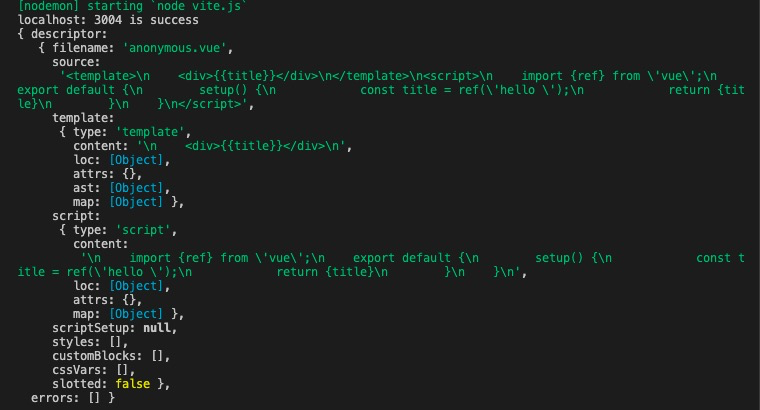

# 一个简易版的vite

**实现功能**

- 能够解析js 
- 能够解析vue
- 能够介解析html

type="module"时候，使用import引入文件，会发送一个请求，因此我们需要启动一个服务器用于拦截文件请求

## 使用一个koa启动server, 根据文件路径判断

- 首页路径直接返回文件内容

```
const Koa = require('koa');
const app = new Koa();

app.use(async ctx => {
    const {url ,query} = ctx.request;
    if (url === '/') { // 如果是‘/’, 直接返回内容
        ctx.type = 'text/html';
        ctx.body = mock(fs.readFileSync('./index.html', 'utf8'))
    } else if (url.endsWith('.js')) {
        // 相应js请求
        const p = path.join(__dirname, url); // 绝对地址
        ctx.type = 'text/javascript';
        ctx.body = rewriteImport(fs.readFileSync(p, 'utf8'));
    }
});

// mock 一些不存在的变量
function mock(content) {
   return content.replace('<script type="module" src="/src/main.js"></script>', `
    <script>
        window.process={env: {NODE_ENV: 'dev'}}
    </script>
    <script type="module" src="/src/main.js"></script>
    `);
};

app.listen(3004, () => {
    console.log('localhost: 3004 is success');
});
```
## 对于相对模块可以直接读取文件内容返回，对于第三方模块需要做特殊处理

- 处理方式：需要读取node_module中安装的对应模块，返回文件内容

```
// 重写导入，变成相对地址
function rewriteImport(content) {
    return content.replace(/ from ['"](.*)['"]/g, ($0, $1) => { // ./ 、../、这种方式存在的相对模块
        // $0 匹配字符串，$1相对内容
        if ($1.startsWith('.') || $1.startsWith('/') || $1.startsWith('../')) {
            // 原封不动
            return $0;
        } else {
            return ` from '/@modules/${$1}'`; // 对于第三方模块需要做特殊处理，添加一个@modules做标记
        }
    });
}
```

- 如果请求的是第三方模块，需要读取node_module中对应的模块

```
else if (url.startsWith('/@modules/')) {
    const moduleName = url.replace('/@modules/', ''); // 获取@modules后面部分，模块名称
    const prefix = path.join(__dirname, '../node_modules', moduleName); // node_module中模块文件地址
    // 要加载文件的地址
    const module = require(prefix + '/package.json').module; // package.json中的module字段既是需要的文件内容
    const filePath = path.join(prefix, module);
    const res = fs.readFileSync(filePath, 'utf8');
    ctx.type = 'text/javascript';
    ctx.body = rewriteImport(res);
} 
```

## 对于vue文件的处理

> 需要使用vue官方提供的解析包对vue文件进行解析, 将vue文件的内容分开处理（script, template）

- 使用 **@vue/compiler-sfc** 解析vue组件



```
else if (url.indexOf('.vue') > -1) {
    // 获取纯粹的文件路径
    const p = path.join(__dirname, url.split('?')[0]); 
    // compilerSfc解析SRC内部的script
    const ret = compilerSfc.parse(fs.readFileSync(p, 'utf8'));
    // 没有query.type -> sfc
    if (!query.type) {
        // 获取脚本内容
        const scriptContent = ret.descriptor.script.content;
        // 转换默认导出配置对象为变量
        const script = scriptContent.replace('export default ', 'const __script =')
        ctx.type = 'text/javascript';
        ctx.body = `${rewriteImport(script)}
            // template解析变成另外一个请求单独做
            import {render as __render} from '${url}?type=template'
            __script.render = __render;
            export default __script
        `;
    } else if (query.type === 'template'){
        const tpl = ret.descriptor.template.content;
        // 编译为render
        const render = compilerDom.compile(tpl, {mode: 'module'}).code;
        ctx.type = 'text/javascript';
        ctx.body = rewriteImport(render);
    }
}
```
## 完整源码

```
// 写一个node服务器，相当于devServer
const Koa = require('koa');
const app = new Koa();
const fs = require('fs');
const path = require('path');
const compilerSfc = require('@vue/compiler-sfc');
const compilerDom = require('@vue/compiler-dom');
// 返回用户首页
app.use(async ctx => {
    const {url, query} = ctx.request;
    if (url === '/') {
        // 首页
        ctx.type = 'text/html';
        ctx.body = mock(fs.readFileSync('./index.html', 'utf8'));
    } else if (url.endsWith('.js')) {
        // 相应js请求
        const p = path.join(__dirname, url); // 绝对地址
        ctx.type = 'text/javascript';
        ctx.body = rewriteImport(fs.readFileSync(p, 'utf8'));
    } else if (url.startsWith('/@modules/')) {
        // 获取@modules后面部分，模块名称
        const moduleName = url.replace('/@modules/', '');
        const prefix = path.join(__dirname, '../node_modules', moduleName); // node_module中模块文件地址
        // 要加载文件的地址
        const module = require(prefix + '/package.json').module;
        const filePath = path.join(prefix, module);
        const res = fs.readFileSync(filePath, 'utf8');
        ctx.type = 'text/javascript';
        ctx.body = rewriteImport(res);
    } else if (url.indexOf('.vue') > -1) {
        // 读取文件内容
        const p = path.join(__dirname, url.split('?')[0]);
        // compilerSfc解析SRC内部的script
        const ret = compilerSfc.parse(fs.readFileSync(p, 'utf8'));
        // 没有query.type -> sfc
        if (!query.type) {
            // 获取脚本内容
            const scriptContent = ret.descriptor.script.content;
            // 转换默认导出配置对象为变量
            const script = scriptContent.replace('export default ', 'const __script =')
            ctx.type = 'text/javascript';
            ctx.body = `${rewriteImport(script)}
                // template解析变成另外一个请求单独做
                import {render as __render} from '${url}?type=template'
                __script.render = __render;
                export default __script
            `;
        } else if (query.type === 'template'){
            const tpl = ret.descriptor.template.content;
            // 编译为render
            const render = compilerDom.compile(tpl, {mode: 'module'}).code;
            ctx.type = 'text/javascript';
            ctx.body = rewriteImport(render);
        }
    } else if (url.endsWith('.png')) {
        ctx.body = fs.readFileSync('src' + url);
    }
})

// 重写导入，变成相对地址
function rewriteImport(content) {
    return content.replace(/ from ['"](.*)['"]/g, ($0, $1) => {
        // $0 匹配字符串，$1相对内容
        if ($1.startsWith('.') || $1.startsWith('/') || $1.startsWith('../')) {
            // 原封不动
            return $0;
        } else {
            return ` from '/@modules/${$1}'`;
        }
    });
}

// mock 一些
function mock(content) {
   return content.replace('<script type="module" src="/src/main.js"></script>', `
    <script>
        window.process={env: {NODE_ENV: 'dev'}}
    </script>
    <script type="module" src="/src/main.js"></script>
    `)
}

app.listen(3004, () => {
    console.log('localhost: 3004 is success');
})
```

参考：[self-vite实例](https://github.com/EvalGitHub/vite-vue3)