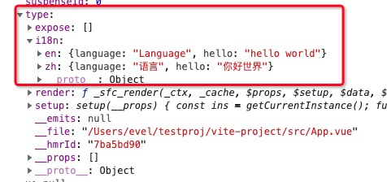

# 如何写一个vite插件

## 熟悉插件钩子

- config 

> 可用于修改vite的配置

- configResolved

> vite 陪你确认

- configureServer 

> 用于配置dev server

- transformIndexHtml

> 转换页面

- resolved

> 创建自定义确认函数，常用于定义第三方依赖

- load

> 创建自定义加载函数，用于返回自定义内容

- transform 

> 用于转换加载的模块内容

- handleHotUpdate

> 自定义HMR更新时调用

## 写一个插件

vite的插件在vite.config.js的plugins中配置，有两种形式：对象，函数（可接受配置参数）

使用方式：直接在vite.config.js文件中plugins中配置

- 写一个i18n的简单插件

1. 创建文件  plugins/i18n-plugins.js
```
export default {
    // code是块的内容
    // id 是文件url
    transform(code, id) {
        if (/vue&type=i18n/.test(id)) {
            // 对于新添加的标签会，发送一个请求，因此只需要根据路径做拦截判读
            return `export default Comp => {
                Comp.i18n = ${code}
            }`
        }
        return null;
    }
}
```

2. 引入自定义插件 （vite.config.js中引入自己创建的插件）
```
import { defineConfig } from 'vite'
import vue from '@vitejs/plugin-vue'
const path = require('path');

import i18n from './plugin/i18n-plugin';

export default defineConfig({
    server: {
     port: '4000',
      proxy: {
          '/api': {
              target: 'https//jsonplaceholder.typicode.com',
              chargeOrigin: true,
                rewrite: path => path.replace(/^\/api/, '')
            }
        }
    },
    resolve: {
        alias: {
            '@': path.resolve('./src'),
            comps: path.resolve('./src/components')
        }
    },
    plugins: [vue(), i18n]
})
```
3. 源码中使用

可以通通过，getCurrentInstance获取组件实例



```
<template>
    <label>国际化：</label>
    <select v-model='local'>
        <option value='en'>en</option>
        <option value='zh'>zh</option>
    </select>
    <p>{{t('hello')}}</p>
</template>
<i18n>
  {
      'en': {
        'language': 'Language',
        'hello': 'hello world'
      },
      'zh': {
        'language': '语言',
        'hello': '你好世界'
      }
  }
</i18n>

<script>
    import {getCurrentInstance, ref, computed} from 'vue';

    const ins = getCurrentInstance(); // 获取组件实例

    function useI18n() {
        const local = ref('zh');
        const i18n = ins.type.i18n;
        const t = msg => {
            return computed(() => i18n[local.value][msg]).value
            // return computed(() => LanguageJson[local.value][msg]).value
        }
        return {local, t}
    };

    const {local, t} = useI18n();
</script>
```

参考：
[vite插件api hook](https://vitejs.dev/guide/api-plugin.html) 、
[i18n实例](https://github.com/EvalGitHub/vite-vue3)，
[vite插件，实现将markdown转成vue组件](https://juejin.cn/post/6948390250003562532)