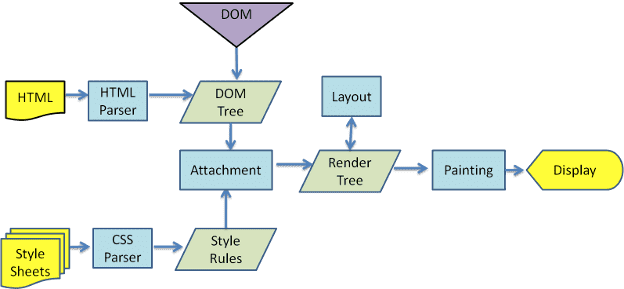
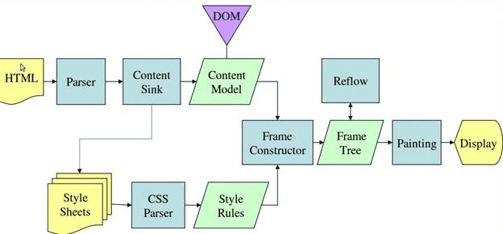
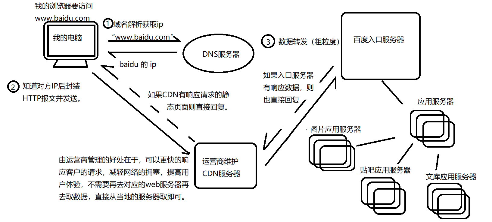

# 关于网页优化的几点

1. 网页渲染的过程
2. 影响网页加载速度的因素
3. 针对性优化的几点

## 网页渲染的过程

大致步骤：

整个过程可以分为几步：

- 用户输入
当用户输入关键字并键入回车之后，这意味着当前页面即将要被替换成新的页面，不过在这个流程继续之前，浏览器还给了当前页面一次执行 beforeunload 事件的机会，beforeunload 事件允许页面在退出之前执行一些数据清理操作，还可以询问用户是否要离开当前页面。

- URL 请求过程
首先，网络进程会查找本地缓存是否缓存了该资源。
如果有缓存资源，那么直接返回资源给浏览器进程；如果在缓存中没有查找到资源，要进行 DNS 解析，以获取请求域名的服务器 IP 地址。发送一个TCP请求，三次握手保证双方通信正常，如果请求协议是 HTTPS，那么还需要建立 TLS 连接，获取数据加密秘钥。

- 利用新建立的TCP管道进行HTTP请求。连接建立之后，浏览器端会构建请求行、请求头等信息，并把和该域名相关的 Cookie 等数据附加到请求头中，然后向服务器发送构建的请求信息。
数据在进入服务端之前，可能还会先经过负责负载均衡的服务器，它的作用就是将请求合理的分发到多台服务器上，这时假设服务端会响应一个 HTML 文件。
首先浏览器会判断状态码是什么，如果是 200 那就继续解析，如果 400 或 500 的话就会报错，如果 300 的话会进行重定向，这里会有个重定向计数器，避免过多次的重定向，超过次数也会报错。
浏览器开始解析文件，如果是 gzip 格式的话会先解压一下，然后通过文件的编码格式知道该如何去解码文件。

- 准备渲染进程
默认情况下，Chrome 会为每个页面分配一个渲染进程，也就是说，每打开一个新页面就会配套创建一个新的渲染进程。

- 渲染阶段
文件解码成功后会正式开始渲染流程，先会根据 HTML 构建 DOM 树，有CSS的话会去构建 CSSOM 树。如果遇到 script 标签的话，会判断是否存在 async 或者 defer ，前者会并行进行下载并执行 JS，后者会先下载文件，然后等待 HTML 解析完成后顺序执行。
如果以上都没有，就会阻塞住渲染流程直到 JS 执行完毕。

cssDom与Html Dom树会合成一个render tree，然后浏览器可以根据这个render tree进行页面布局（layout）计算（元素占据空间大小，排版位置），形成layout tree；接下来便是paint(绘制)，包括文本，颜色 ，边框，阴影，根据layer tree生成绘制记录。

需要注意的是对页面的DOM元素的绘制是在多个渲染层上进行的，每个层上完成绘制过程之后，浏览器需要使用**合成线程(compositer线程)**将所有层按照合理的顺序合并成一个图层，然后交给GPU渲染页面。

[script 标签的defer,async的作用，及拓展浏览器多线程，DOMContentLoaded](https://www.cnblogs.com/evaling/p/10677566.html)

CSSOM 树和 DOM 树构建完成后会开始生成 Render 树，这一步就是确定页面元素的布局、样式等等诸多方面的东西
在生成 Render 树的过程中，浏览器就开始调用GPU 绘制，合成图层，将内容显示在屏幕上了。

**问题一：** 至于拿到资源之后浏览器怎么处理?

不同的浏览器内核不同渲染方式：

**第一种：**

**第二种：weblit渲染流程**

看完上面的过程大致可以总结出以下的几个过程

**结论：**

- HTML解析出DOM Tree
- CSS解析出css tree

css下载不会阻塞DOM的解析，但会阻塞DOM树的渲染，js会阻塞DOM的解析，以及渲染

- 将二者关联生成Render Tree
- Layout 根据Render Tree计算每个节点的信息
  - 创建渲染树之后，就是布局（回流），通过渲染树中的渲染对象信息计算出一个对象的位置与尺寸安置在页面的正确位置。衍生出一个概念回流
- Painting 根据计算好的信息绘制整个页面
  - 在绘制阶段，系统会遍历呈现树，并调用呈现器的“paint”方法，将呈现器的内容显示在屏幕上。 衍生出一个概念重绘

针对以上的过程常见的两个问题？

1. css加载会阻塞网页的渲染吗？
> 会，因为css会形成css tree最终与dom tree一起渲染成render tree
2. js的加载会阻塞网页的渲染吗？
> 会，上图没有体现出来，因为js资源的加载会阻塞dom tree的形成（JS可能会改动DOM和CSS，所以继续解析会造成浪费）,这也是为什么会有将js资源script标签放在body之后优化手段，以及[script的defer,asyn存在的意义](<https://www.cnblogs.com/evaling/p/10677566.html>)。

## 针对网页实现过程，我们可以做出以下的优化实践技巧：

- HTML文档结构层次尽量少，简单，少些无用的标签
  - 因为会加长html的解析，影响domTree的形成时间

- script脚本尽量放在body之后
  - js资源的加载会阻塞html的渲染

- 样式结构层次尽量简单
  - 存在一个问题（sccs,less这种嵌套语法会影响加载时间吗？）

- 减少dom操纵，避免回流
  - 在频繁操作某个dom元素时，可以利用dom碎片或者可以将这个元素先display:none或者隐藏起来（减少重绘的可能性）

- 动画
  尽量使用transform来代position:absolute，GPU硬件加速（
    在合成情况下，直接跳过布局和绘制流程，交给合成线程处理
    1. 能够充分发挥GPU的优势。合成线程生成位图的过程中会调用线程池，并在其中使用GPU进行加速生成，而GPU 是擅长处理位图数据的。

    2. 没有占用主线程的资源，即使主线程卡住了，效果依然能够流畅地展示
  ）

- 使用服务器ssr渲染（next.js/nuxt.js）,让代码在服务器先执行一次，使得用户下载的HTML已经包含了所有页面展示的内容，减少了浏览器解析html生成页面的这个费时间的过程

## 针对网页资源下载，我们可以可以做什么优化呢？

这个过程包括的浏览器获取资源的信息，也就是输入域名到浏览器返回资源信息之间的这个过程。

**首先先了解下整个过程是怎么样的？**

1. 域名解析完之后，浏览器与服务器建立TCP连接(三次握手)
2. 浏览器发送请求到服务器
3. 服务器做出响应数据转发

> 大致过程就是:浏览器解析域名，发送请求与服务器建立tcp链，接服务器返回资源

这个过程中我们可以很容易察觉到几个比较费时间的点？

- 浏览器与服务器频繁的建立链接（三次握手）
- 浏览器针对于Http1下载资源的策略限制
- 数据传输的时间消耗
- 资源文件包的太大

**浏览器与服务器频繁建立连接**

建立连接是一个比较费时间的过程，因此使用持久连接(每个连接可以处理多个请求-响应事务,Http/1.1默认支持)，以及双工通信（webSocket）都是对这个问题的优化。

**关于http1下载资源策略的限制**

- http1.1的长链接

问题：虽然是一个长链接可以有效的减少频繁链接的时间消耗，但是对于连接中发送的多个请求的处理方式确实顺序执行，这样就会造成任务阻塞的问题。

 **优化方案一：** http2.0多路复用就是一个通道可以让多条线路同时占用而不会出现混乱，为每一个请求带一个编号，它样服务器方就能为请求的回应对上号了。如果一个请求时间过长，那么服务器就可以先暂停这个请求，先处理下一个请求，处理完再回来处理这个长请求，如果找回这个长请求，那就靠这个编号了。

 **优化方案二：** 或者减少http请求数量，例如资源合并，对应在前端的实际场景有
  - 图片资源的合并雪碧图
  - style-loader将css文件添加到html文件中
  - url-loader将符合大小的图片转化成base64的文件形式之间融合在css文件中或 者html文件中

 > 以上的第二点，第三点使用时候要权衡利弊，因为会增加首页渲染时间

**关于数据传输的时间消耗**

从浏览器的向服务器发送请求，再到服务器响应请求回送数据这是一个数据传输的过程，
这个数据传输的过程与物理距离有着十分大的关系，可以考虑使用CDN加速处理。

**针对资源包太大的问题**

现在的项目一般而言都是使用webpack来进行构建的，他提供了很多优化技巧：
- 代码压缩工具减少代码体积
- 开启生成模式的tree shaking去掉没有使用的代码
- 代码分割code spliting
- 路由分割
- 懒加载（按需加载）

另外针对与资源文件体积的大小优化，还涉及到<a target='blank' href='/前端杂记/关于图片的优化.html'>图片资源的处理</a>

> 推荐两个比较好的第三方插件：

- [react-imported-component](https://www.npmjs.com/package/react-imported-component)

用于代码分割

- [react-lazyload](https://www.npmjs.com/package/react-lazyload)

用于组件，图片等资源的懒加载

## 为什么不将css也放置在body底部？

首先需要明确的是，css下载执行是不会阻塞html的解析(但是会阻塞界面的最终形成)，他们是可以并行执行的，但是js执行是会阻塞html解析的;
对于首页显示有影响的css文件（说明是页面相关的核心css文件）建议放置head中是会有利于页面的渲染的，如果放置在底部会导致renderTree的多
次渲染；如果是那种与首页渲染无关的css文件，建议放在body尾部，因为这种文件一般比较大，如果放置在head中它的下载执行会阻塞界面的渲染。
但是如果与首页有关而且有很大，那么真的需要审视下是不是可以压缩css文件大小，以及css样式优化。

关于js文件一般来说都是功能逻辑代码，他们与页面的效果几乎没有多大影响，如果放置在head中是会阻塞页面渲染的，所以建议放置body底部。

参考文章：
- [浏览器渲染页面过程与页面优化](https://segmentfault.com/a/1190000010298038#articleHeader7)

- [输入网址到资源获取的过程](https://www.cnblogs.com/shy0322/p/9276883.htmle)

- [什么是CDN，以及优势](<https://www.zhihu.com/question/36514327/answer/68143522>)

- [CDN能解决什么问题](<https://blog.csdn.net/chuwo0959/article/details/100618113>)

- [HTTP2.0与HTTP1.1的区别](<https://blog.csdn.net/xx666zz/article/details/85337472>)

- [二进制文件与文本文件的区别](<https://blog.csdn.net/dongchongyang/article/details/79044082>)

- [ssr技术存在的意义及讲解](<https://juejin.im/post/5bc7ea48e51d450e46289eab?utm_medium=hao.caibaojian.com&utm_source=hao.caibaojian.com>)

- [从浏览器渲染原理，说一说如何实现高效的动画](<https://juejin.im/post/5d2491ba6fb9a07ecf724b69>)
